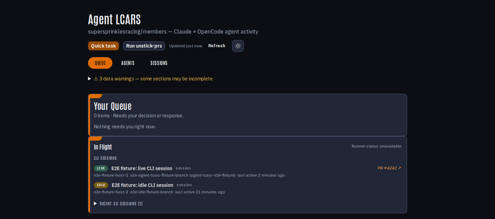

# Agent LCARS

Agent LCARS operates and observes headless Claude Code, Codex, and OpenCode
work on the shared self-hosted GitHub Actions runner fleet.



## Dispatch

Add exactly one routing label to an issue in an onboarded repository:

| Label            | Agent       |
| ---------------- | ----------- |
| `agent:claude`   | Claude Code |
| `agent:codex`    | Codex       |
| `agent:opencode` | OpenCode    |

The [shared agent protocol](.agents/skills/agent-protocol/reference/agent-protocol.md)
is the complete behavioral contract for every dispatched run. The
[LCARS skill](.agents/skills/lcars/SKILL.md) is a situational control-plane
reference for developers changing dispatch and reconciliation machinery.

## Operating surfaces

| Surface                        | Use                                             |
| ------------------------------ | ----------------------------------------------- |
| Console queue (`/`)            | Work requiring a maintainer action              |
| Console agents (`/agents`)     | Active runs, CLI sessions, and recent outcomes  |
| Console sessions (`/sessions`) | Search and inspect session records              |
| `apps/telemetry-watcher`       | Interactive and CI session telemetry            |
| `apps/runner-autoscaler`       | Runner placement and lifecycle                  |
| `apps/github-actions-exporter` | GitHub Actions metrics                          |
| `infra/terraform`              | GCP services, IAM, storage, secrets, and budget |

## Documentation map

| Need                                    | Source of truth                                                                                   |
| --------------------------------------- | ------------------------------------------------------------------------------------------------- |
| Onboard a repository to the agent fleet | [Repository onboarding](docs/onboarding-repo.md)                                                  |
| Add a runner registration               | [Autoscaler onboarding](docs/onboarding-autoscaler.md)                                            |
| Agent labels and routing                | [GitHub label contract](docs/github-label-contract.md)                                            |
| Credentials and GitHub App identity     | [Fleet credentials](docs/fleet-credentials.md) and [bot identities](docs/bot-identity-formats.md) |
| CI dispatch and published actions       | [Published actions](docs/published-actions.md)                                                    |
| Local/CI E2E boundary                   | [E2E security boundary](docs/e2e-security-boundary.md)                                            |
| E2E test policy                         | [E2E reliability](docs/e2e-reliability.md)                                                        |
| Runtime diagnosis                       | [Lifecycle systems](docs/lifecycle-systems.md)                                                    |

## Development

Use the Node and pnpm versions pinned in `package.json`:

```sh
pnpm install
pnpm verify
```

The root README intentionally does not duplicate deployment steps, runner
topology, credential setup, or migration history. Those details belong to the
focused documents above and must be verified against their owning source.
