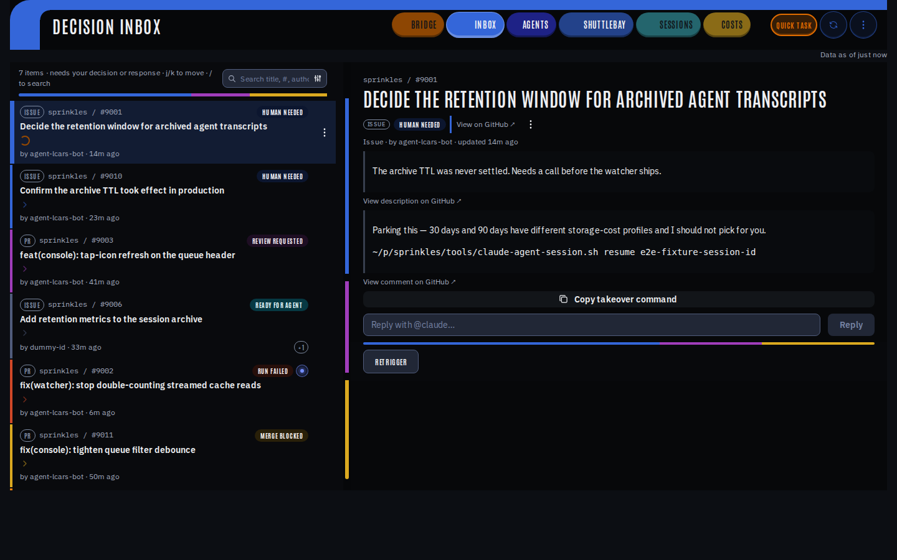
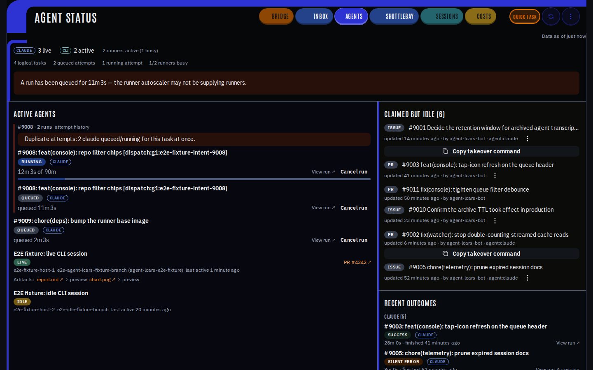
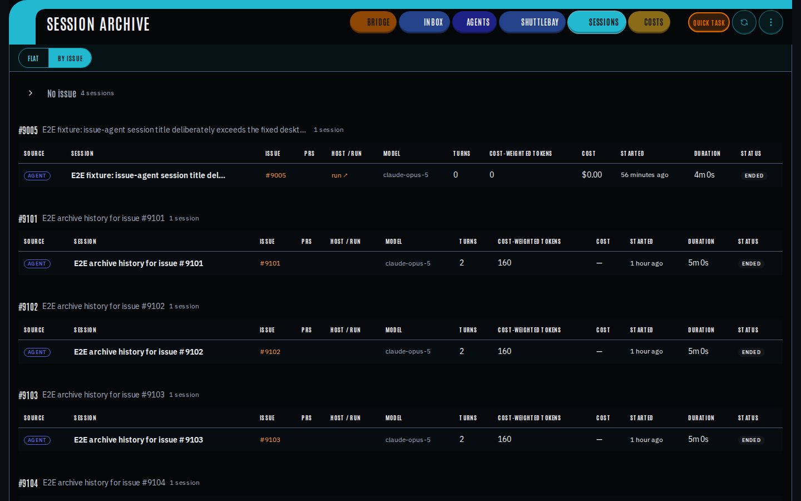

# Agent LCARS

Agent LCARS is the control plane for headless Claude Code, Codex, and OpenCode
work on the shared self-hosted GitHub Actions runner fleet. It turns GitHub
issues into accountable agent work, shows maintainers where attention is
needed, and retains the session evidence behind each outcome.



## Dispatch

To dispatch work, add exactly one routing label to an issue in an onboarded
repository:

| Label            | Agent       |
| ---------------- | ----------- |
| `agent:claude`   | Claude Code |
| `agent:codex`    | Codex       |
| `agent:opencode` | OpenCode    |

The [shared agent protocol](.agents/skills/agent-protocol/reference/agent-protocol.md)
is the complete behavioral contract for every dispatched run. The
[LCARS skill](.agents/skills/lcars/SKILL.md) is a situational control-plane
reference for developers changing dispatch and reconciliation machinery. The
console then tracks the run from intake through review, merge, and any
maintainer follow-up.

## Operating surfaces

Use the console for decisions and inspection; use the supporting services when
working on a specific part of the fleet.

| Surface                        | Use                                             |
| ------------------------------ | ----------------------------------------------- |
| Console queue (`/`)            | Work requiring a maintainer action              |
| Console agents (`/agents`)     | Active runs, CLI sessions, and recent outcomes  |
| Console sessions (`/sessions`) | Search and inspect session records              |
| `apps/telemetry-watcher`       | Interactive and CI session telemetry            |
| `apps/runner-autoscaler`       | Runner placement and lifecycle                  |
| `apps/github-actions-exporter` | GitHub Actions metrics                          |
| `infra/terraform`              | GCP services, IAM, storage, secrets, and budget |

## Console views

The console keeps the active fleet, its decision queue, and its session
history in focused workspaces. The Decision Inbox is the starting point for
work that needs a human response; Agents is the live operational view; and the
Session Archive is the durable record for investigation and audit.

### Active agents



### Session archive



## Documentation map

| Need                                    | Source of truth                                                                                   |
| --------------------------------------- | ------------------------------------------------------------------------------------------------- |
| Onboard a repository to the agent fleet | [Repository onboarding](docs/onboarding-repo.md)                                                  |
| Add a runner registration               | [Autoscaler onboarding](docs/onboarding-autoscaler.md)                                            |
| Agent labels and routing                | [GitHub label contract](docs/github-label-contract.md)                                            |
| Credentials and GitHub App identity     | [Fleet credentials](docs/fleet-credentials.md) and [bot identities](docs/bot-identity-formats.md) |
| CI dispatch and published actions       | [Published actions](docs/published-actions.md)                                                    |
| Local/CI E2E boundary                   | [E2E security boundary](docs/e2e-security-boundary.md)                                            |
| E2E test policy                         | [E2E reliability](docs/e2e-reliability.md)                                                        |
| Runtime diagnosis                       | [Lifecycle systems](docs/lifecycle-systems.md)                                                    |

## Development

Use the Node and pnpm versions pinned in `package.json`:

```sh
pnpm install
pnpm verify
```

Start with the focused document that matches your task. This README intentionally
does not duplicate deployment steps, runner topology, credential setup, or
migration history; those operational contracts live with their owning systems
and should be verified there.

## Native work smoke

2026-08-27
