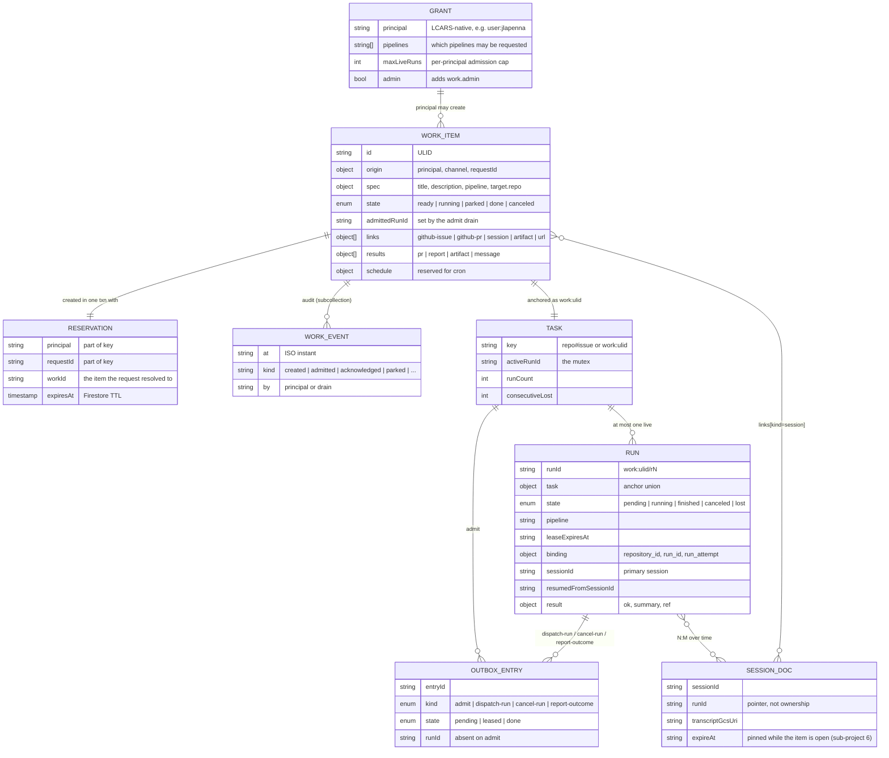
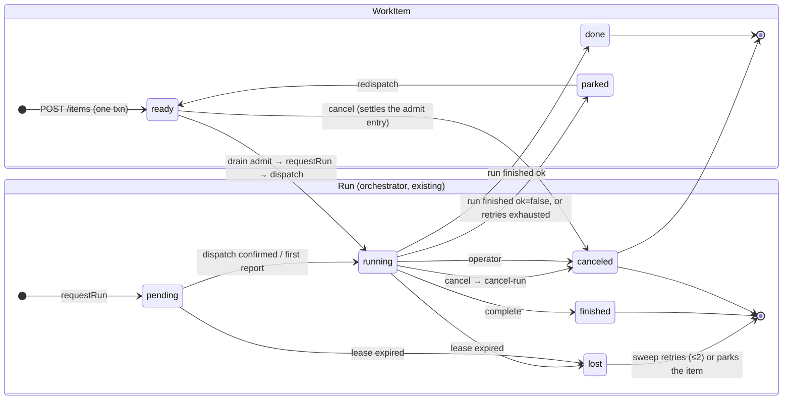

# Native work items: a GitHub-independent task system

- **Status:** Approved design, pre-implementation
- **Date:** 2026-08-23
- **Scope:** Design for the whole program; implementation scope for
  sub-project 1 only (see [Sequencing](#sequencing)).

## Problem

GitHub is currently the fleet's only ingress, its only task store, and its
only execution queue. A task _is_ a GitHub issue (`libs/orchestrator`'s
`TaskId = {repo, issue}`), dispatch _is_ a label webhook, execution _is_ a
`workflow_dispatch` onto GitHub Actions, and the human-interaction surface
(parking, outcome comments, redispatch triggers) lives entirely on issue
threads. That blocks two wanted capabilities:

1. **Agent-initiated work** — an agent (interactive session, fleet member,
   or service) asking LCARS to do work directly, with no human touching
   GitHub. This is the driving use case.
2. **Scheduled/recurring work** — cron-style self-originated tasks.

It also makes runner execution inseparable from GitHub Actions queues, which
the fleet wants as an eventual, swappable backend rather than a load-bearing
assumption.

## Decisions already made

Recorded from the brainstorming session that produced this spec:

| Question                       | Decision                                                                                                                                                                                                                                                                                   |
| ------------------------------ | ------------------------------------------------------------------------------------------------------------------------------------------------------------------------------------------------------------------------------------------------------------------------------------------ |
| First end-to-end consumer      | Agent-initiated work via API                                                                                                                                                                                                                                                               |
| Deliverable model              | Generic typed results; only the PR result path wired in v1                                                                                                                                                                                                                                 |
| GitHub's role for native tasks | None required. Native-first: console + API are the interaction surface; GitHub issues/PRs are optional typed _links_ (references/evidence)                                                                                                                                                 |
| API transport                  | Versioned REST on the console + `lcars work` CLI subcommands; MCP can wrap later                                                                                                                                                                                                           |
| Auth                           | Standard OAuth 2.0 resource server; trusted OIDC issuers as configuration; no Google dependency in the contract                                                                                                                                                                            |
| Structure                      | New `libs/work` layer above the orchestrator (approach B). The orchestrator keeps its admission-mutex _job_; making it anchor-aware is real, bounded work — sub-project 1a                                                                                                                 |
| Naming                         | `WorkItem` / `libs/work` / `lcars work` — deliberately not "task", which the orchestrator already uses for its anchor                                                                                                                                                                      |
| Pipeline selection             | `spec.pipeline` is required; no default. Triggering a pipeline is a per-principal grant, so not every agent can invoke every pipeline                                                                                                                                                      |
| Admission                      | Per-principal live-run cap plus a global cap, both configuration; exceeding either is `429`                                                                                                                                                                                                |
| Modes                          | None on a WorkItem. A review is a specialized task (description + `github-pr` link), not a dispatch mode                                                                                                                                                                                   |
| v1 human issuer                | Google to start (ratified 2026-08-24) via per-user **service-account impersonation** — a Google user credential cannot mint an audience-scoped ID token; LCARS-minted tokens arrive with sub-project 4                                                                                     |
| Run binding                    | Deterministic: the gate fetches the Actions run named by the token's own `(repository, run_id)` and requires its dispatch marker to carry this runId; pair stored, `run_attempt` checked, invalidated on settle. Native runs complete via `POST /runs/:runId/complete`, finalizer included |
| Sessions                       | WorkItem 1→N Run; Run↔Session N:M over time (primary session recorded per run). Resume + lifecycle-pinned persistence are sub-project 6                                                                                                                                                    |
| API shape                      | Resource-oriented (`items`, `runs`; `grants`/`caps` later) with additive OAuth2 scopes `work.agent` / `work.operator` / `work.admin`; issuers confine which scopes they may confer                                                                                                         |
| Ownership                      | `cancel`/`redispatch` are the requester's or an admin's; reads are open to any granted principal; the `runs` routes belongs to the bound run alone                                                                                                                                         |
| Creation                       | One Firestore transaction (idempotency reservation + WorkItem + `admit` outbox entry); `requestRun` is the drained side effect, and the admit drain is item-state-checked so a re-drain can never mint a second run                                                                        |
| Status and targets             | Poll-only status in v1; items without `target.repo` are rejected while GitHub Actions is the only backend                                                                                                                                                                                  |
| \1                             | v1 scope                                                                                                                                                                                                                                                                                   | Split (decided 2026-08-25): **1a** orchestrator generalization with zero behavior change for GitHub anchors; **1b** `libs/work`, API, auth gate, CLI, native lane path, console pages | \n  | WorkItem events | A subcollection, not a bounded array — a WorkItem lives forever and is redispatched without limit, so `Run.events`'s hard `max(64)` would eventually make it unreadable | \n  |

## Architecture

```
ingress adapters                 libs/work                 execution backends
----------------                 ---------                 ------------------
REST API (v1)      ─┐                                   ┌─ GitHubActionsExecutor (v1)
webhook (later)    ─┼─▶ createWorkItem() ─▶ WorkItem ─▶ Executor
cron (later)       ─┤          │              │         └─ QueueExecutor (later)
console (later)    ─┘          ▼              ▼
                        libs/orchestrator (same job, anchor-aware:
                        per-task mutex, leases, bounded
                        retry, transactional outbox)
```

Invariants:

- Ingress adapters converge on one internal `createWorkItem()`. The `runs`
  routes write only run-scoped fields (progress, links, results); every
  WorkItem _state_ transition is the outbox drain's projection of an
  orchestrator decision, never a route effect.
- `libs/work` is the only caller of the orchestrator's `requestRun` for
  native tasks, so admission rules stay in one place.
- `libs/work` depends on `libs/orchestrator`, never the reverse. The
  orchestrator continues to treat work as opaque.
- A run talks to the control plane **only** through the run-lifecycle API
  (fetch spec, renew lease, attach links, report results, report
  completion), starting in v1. If the v1 workflow needs something, it gets
  an API route, not a workflow input. This discipline is what makes the
  later non-GitHub execution backend a drop-in.

## Data model

Two layers, each keeping one job: `libs/work` records what is wanted and
what happened; the orchestrator records admission and execution. Telemetry
sits beside both.

### Overview



| Collection                             | Owner               | Written by                                                                                                       |
| -------------------------------------- | ------------------- | ---------------------------------------------------------------------------------------------------------------- |
| `workItems/{ulid}`                     | `libs/work`         | `createWorkItem()` (create); the outbox drain (every `state` transition); `runs` routes (run-scoped fields only) |
| `workItems/{ulid}/events/{id}`         | `libs/work`         | Same writers, append-only                                                                                        |
| `workRequests/{principal}/{requestId}` | `libs/work`         | `createWorkItem()`, same transaction as the item                                                                 |
| grants                                 | configuration       | Maintainer; becomes a `grants` resource when an admin agent needs it                                             |
| `tasks/{key}`                          | `libs/orchestrator` | Orchestrator transactions only                                                                                   |
| `runs/{runId}`                         | `libs/orchestrator` | Orchestrator transactions; the gate adds `binding` on first verified call                                        |
| `outbox/{entryId}`                     | `libs/orchestrator` | Orchestrator decisions (enqueue); the drain (lease, settle)                                                      |
| `sessions/{sessionId}`                 | `libs/telemetry`    | The telemetry sidecar; untouched by this design                                                                  |

Three rules hold the model together:

1. **Anchor, not ownership.** The orchestrator knows a task only by its
   anchor; `libs/work` depends on it, never the reverse.
2. **Decisions vs. projections.** Orchestrator transactions decide; outbox
   entries carry the side effects; `WorkItem.state` is a projection the
   drain writes. No API route mutates state directly.
3. **Identity is the write guard.** A run writes only run-scoped fields
   under `work.agent` bound to its own `runId`; operators write items
   under `work.operator`; scopes are additive and issuers confine what they
   may confer.

### `WorkItem` (new, `libs/work`, Firestore collection `workItems`)

The first-class task and source of truth.

- `id` — native ULID. Sortable, no GitHub semantics.
- `origin` — who asked and how:
  `{ principal, channel: 'api' | 'webhook' | 'cron' | 'console', requestId }`.
  `requestId` is the idempotency key: replays return the existing item.
- `spec` — what is wanted:
  `{ title, description, pipeline, target?: { repo } }`. `pipeline`
  is required — there is no default, because invoking a pipeline is a
  granted capability (see
  [Authorization and admission](#authorization-and-admission)). There is
  no `mode`: a review is a specialized task whose description says so and
  whose PR is a `github-pr` link, not a separate dispatch mode. The
  orchestrator's `params.mode` continues to exist for label-driven work
  only.
  `target` is schema-optional — that is the GitHub-optional part — but v1
  rejects its absence at the API (see Backend 1). There is no `target.ref`
  in v1: the dispatch drain hard-codes `ref: main` and the OIDC predicate
  requires it, so accepting a ref would mean silently ignoring it.
- `state` — `ready | running | parked | done | canceled`. Work lifecycle,
  distinct from the orchestrator's run lifecycle. `parked` is the native
  home of what `status:needs-human` means today.
- `links[]` — typed references (the "evidence" concept), bounded at 64:
  `{ kind: 'github-issue' | 'github-pr' | 'session' | 'artifact' | 'url',
ref, note?, addedBy, at }`. A GitHub issue is just one of these.
- `results[]` — typed outcomes, bounded at 32; see
  [Deliverables](#deliverables-results-and-evidence).
- `schedule?` — reserved for the cron sub-project. Unset and unread in v1.
- `events` — the audit trail, as a **subcollection** (`workItems/{id}/events`),
  not an array. `Run.events` is a `max(64)` array parsed on every read, which
  is fine for a run (a handful of events) and wrong for an item that lives
  forever and is redispatched without limit: the 65th event would make the
  document unreadable, and every list view with it.

All schemas are strict zod objects with bounded strings, matching house
style in `libs/orchestrator/src/model.ts`.

### Lifecycles

Two state machines, deliberately distinct. The run's is the orchestrator's
existing one; the item's is driven only by the drain projecting run
settlements and operator actions.



A `lost` run does not touch the item directly: the sweep either mints a
fresh run (the item stays `running`) or, once the retry budget is spent,
settles with a failure that the drain projects as `parked`.

### Sessions: how WorkItem, Run, and agent session relate

Telemetry already stores an agent session as its own document at
`sessions/{sessionId}` (`libs/telemetry/src/lib/session-doc.ts`) carrying
a _pointer_ to the run (`runId`, `repo`, `transcriptGcsUri`) and an
`expireAt` derived from last activity. The relationships follow from that:

- **WorkItem 1 → N Run**, sequential: the orchestrator's mutex allows at
  most one live run; `redispatch` mints the next.
- **Run 1 → N Session, and a Session may span Runs.** A run has one
  _primary_ session (the CLI the workflow starts), possibly subagent
  sessions, and for OpenCode none at all. A session outlives its run — an
  interactive takeover continues the same session ID after the runner is
  gone — and a later run may _resume_ an earlier run's session (decided
  2026-08-24). Run↔Session is therefore N:M over time. What is 1:1 is a
  run's primary session at start: each `Run` records `sessionId` and, when
  it resumed, `resumedFromSessionId`.
- The WorkItem sees sessions only through `links[]` of kind `session`.
  A session is evidence of how work was done, not the work.

**v1 seams.** The run reports its primary session through
`POST /runs/:runId/links` kind `session` (already in the native-mode
table); `libs/work` records it on the `Run`. Nothing else ships in v1.

**Later: session resume and persistence (sub-project 6).** These are one
feature, not two — resume is only reliable if the session survives:

- `POST /items/:id/redispatch` accepts `{ resumeSessionId? }`. The
  executor passes it to the worker; the runner bootstrap restores the
  archived transcript and starts the agent in resume mode
  (`claude --resume`). Provider-honest, as in the takeover section: only
  agents with an archive and a resume path support it, and the API rejects
  the request for the others rather than silently starting fresh.
- **Persistence is pinned to the item's lifecycle.** A session linked to a
  WorkItem that is not `done` or `canceled` is not reaped: no `expireAt`
  expiry, and its transcript archive is retained. The pin is released when
  the item settles, after which the normal retention window applies.

### Orchestrator changes (sub-project 1a)

The orchestrator keeps its job — admission mutex, leases, bounded
auto-retry, transactional outbox — but "unchanged" was wrong: the review
of this spec found every place the code assumes a task is a GitHub issue.
1a makes the orchestrator anchor-aware and lands with **zero behavior
change for GitHub anchors**, proven by the existing tests plus persisted-
shape fixtures, before anything uses the new anchor.

**Anchor.** `TaskId` becomes a union of two shapes — the existing
`{ repo, issue }` object, kept byte-for-byte as persisted today, and a new
`{ workId }` — discriminated by which key is present, never by a new
required field: `FirestoreStore` zod-parses every persisted Task, Run, and
OutboxEntry on read, and each embeds `task: { repo, issue }`, so a variant
requiring a field legacy documents lack would reject the whole dataset.
`taskKey()` emits `repo#issue` (unchanged) or `work:<ulid>`; doc IDs are
`encodeURIComponent(taskKey())`, and `:` is outside the repo-name charset,
so the keys cannot collide. Zero Firestore migration.

**Every `task.repo` / `task.issue` dereference.** These exist today and
each one breaks on a `{ workId }` anchor:

- `FirestoreStore.listRuns` queries `task.repo`/`task.issue` — the SDK
  throws on `undefined` values. It gains an anchor-aware query; the store
  contract spec covers both anchors.
- `orchestrator-dispatch.ts` (workflow URL, installation token, `issue`
  input, needs-human label), `orchestrator-routes.ts` (the completion
  route's `run.task.issue === body.issue` tie), and
  `orchestrator-terminal-runs.ts` (keys live runs by `task.repo`) all
  read the anchor directly. They move to one helper,
  `anchorTarget(run)`, which yields the repository for a GitHub anchor and
  the WorkItem's `spec.target.repo` for a native one. As a TS union these
  become compile errors, which is the point.

**Outbox.** The schema is a strict two-kind enum (`dispatch-run`,
`report-outcome`) with a required `runId`, parsed for every entry inside
the claim transaction — one foreign document would make every drain
throw. 1a discriminates the schema on `kind` and adds two kinds:

- `admit` (task-scoped, no `runId` — `requestRun` is what mints the run),
  drained by a new branch; see the create path for its state check.
- `cancel-run`, drained by a new branch that calls `Executor.cancel` with
  the run's stored Actions binding (or, unbound, the dispatch-marker
  listing keyed by `anchorTarget`). Today `cancelRun` emits only
  `report-outcome`, so a cancelled native run's job would keep running.

`report-outcome` dispatches on anchor kind: a GitHub anchor posts the
issue comment and label exactly as today; a native anchor performs the
WorkItem transition (`done`, `parked`, `canceled`) and touches GitHub not
at all. Without this branch the entry would fail forever at the head of
every drain — `claimPendingOutbox` re-claims expired leases first — and
block every legacy delivery behind it.

**Drain discipline.** A drain branch settles an entry `done` for every
_permanent_ outcome (`duplicate-request`, `task-busy`, an item no longer
`ready`, an unknown run) and records the outcome as an event; only
transient failures release an entry to `pending`. An entry that can never
succeed must never be retried forever.

**No queueing.** `queueIfBusy` and `pendingRequest` were removed in
#1503; nothing in this design queues a request on a busy task.

## API and auth

### Resources and scopes

Resource-oriented REST under `apps/console/src/app/api/work/v1/`: the URL
names a resource, never the caller's role. Two resources exist in v1 —
`items` and `runs` — with fleet-management resources (`grants`, `caps`)
arriving when those leave configuration. Authorization is by **OAuth2
scope**, the standard mechanism for trust levels, so the split between
"a run reporting on itself" and "someone issuing work" is a property of
the token, not of the path.

Scopes are additive — a principal may hold several:

| Scope           | Confers                                                                                          | Typically held by                                                  |
| --------------- | ------------------------------------------------------------------------------------------------ | ------------------------------------------------------------------ |
| `work.agent`    | The `runs/:runId` routes for **one** run; this scope is always bound to a run ID                 | A dispatched run (`agent:run/<runId>`)                             |
| `work.operator` | Issue and follow work; cancel/redispatch own items; attach links                                 | Granted humans, requester agents, services                         |
| `work.admin`    | Everything `work.operator` can, on any item; `grants`/`caps` management once those are resources | Admin principals (the console's `isAdmin`); admin implies operator |

What is fixed is not how many scopes a principal holds but **what each
issuer may confer**: a GitHub Actions OIDC token yields `work.agent` bound
to the run it authenticates as and nothing else; grant configuration
yields `work.operator` and `work.admin`. A run that must request
follow-up work is a legitimate future case — an LCARS-minted token
(sub-project 4) carrying both `work.agent` and `work.operator` — allowed
by this design, just not by v1's issuers.

**`items` — issuing and following work.**

| Route                        | Scope                                      | Purpose                                                                                                                                            |
| ---------------------------- | ------------------------------------------ | -------------------------------------------------------------------------------------------------------------------------------------------------- |
| `POST /items`                | `work.operator`                            | Create a WorkItem. Caller supplies `requestId`; replays dedupe (same contract as the orchestrator's `duplicate-request`). Returns `202` + item ID. |
| `GET /items/:id`             | `work.operator`                            | Full state: spec, work state, runs, links, results, events.                                                                                        |
| `GET /items`                 | `work.operator`                            | List/filter by state, principal, target repo.                                                                                                      |
| `POST /items/:id/cancel`     | `work.operator` (own) / `work.admin` (any) | Stop.                                                                                                                                              |
| `POST /items/:id/redispatch` | `work.operator` (own) / `work.admin` (any) | Parked → ready; mints a fresh run. API-native analog of today's reply triggers.                                                                    |
| `POST /items/:id/links`      | `work.operator`                            | Attach a typed reference (a human or requester adding evidence).                                                                                   |

**`runs/:runId` — a run reporting on itself.** Every route requires
`work.agent` bound to that exact run ID; keyed by run, not item, because a
run may only ever speak for itself.

| Route                        | Purpose                                                                                                                                                                                                                            |
| ---------------------------- | ---------------------------------------------------------------------------------------------------------------------------------------------------------------------------------------------------------------------------------- |
| `GET /runs/:runId`           | The run's spec and item snapshot. The first authenticated call performs the run binding and records an `acknowledged` event.                                                                                                       |
| `POST /runs/:runId/renew`    | Renew the orchestrator lease.                                                                                                                                                                                                      |
| `PUT /runs/:runId/progress`  | Replace the run's single bounded progress note (the native form of the protocol's one edited progress comment).                                                                                                                    |
| `POST /runs/:runId/links`    | Attach a typed reference on the run's behalf (session, PR).                                                                                                                                                                        |
| `POST /runs/:runId/results`  | Report a typed result.                                                                                                                                                                                                             |
| `POST /runs/:runId/complete` | Terminal report `{ ok, summary }`, forwarded to `orchestrator.report`. The route returns the orchestrator's outcome (`run-not-live` → `409`); the item's transition is the drain's projection of the settle, never a route effect. |

Run IDs contain `/` (`work:<ulid>/r1`); the `:runId` path segment is
`encodeURIComponent`-encoded, the same encoding the Firestore doc IDs use.

The `runs` routes are the **complete** channel a run has to the control
plane. That list is the contract the later non-GitHub backend depends on;
extending it is fine, bypassing it is not. Each route declares its
required scope; the gate checks the scope and, for `work.agent`, the run
binding — a token whose scope does not cover the route gets `403`.

Create is one Firestore transaction, then `202`: validate → check the
admission caps → reserve the idempotency key → write the WorkItem in state
`ready` → enqueue an `admit` outbox entry. The transaction is the whole
decision; `requestRun` is its side effect, called by the drain's `admit`
branch. A crash after commit is repaired by the next drain; a crash before
commit leaves nothing behind. This is the orchestrator's own rule — the
decision and its side effect are never one step — applied one layer up.

- **Idempotency is transactional.** The reservation is a document keyed by
  `(principal, requestId)` written in the same transaction as the WorkItem,
  so concurrent replays contend on one document and converge on one ULID.
  A replay returns the reserved item.
- **The admit drain is state-checked.** The orchestrator's own
  `duplicate-request` dedupe holds only while the minted run is _live_, so
  an at-least-once `admit` re-drained after r1 has already settled would
  mint r2 for a done or parked item. The branch therefore runs a
  transaction of its own: the item must still be `ready` with no
  `admittedRunId`; it calls `requestRun`, records `admittedRunId`, and
  settles the entry `done`. Any other item state settles the entry `done`
  as a no-op.
- **Cancel while `ready`.** No run exists to cancel. The route marks the
  item `canceled` and settles its `admit` entry `done` in one transaction,
  so a later drain cannot mint a run for a canceled item.
- **Repair sweep — new, not existing.** Today's reconcile handler settles
  terminal runs, sweeps leases, and drains; it repairs nothing about work
  items. 1b adds `libs/work`'s `sweep()` to it: a `ready` item older than
  the admit lease with no `admittedRunId` gets a fresh `admit` entry.

`requestRun` outcomes surface as item events, not HTTP statuses: by the
time the orchestrator decides, `POST /items` has already returned `202`.
The admission caps are the only synchronous refusal (`429`).

Status is poll-only in v1 (the CLI offers `--watch` by polling); no
streaming.

### One request, end to end

Where each write happens, and which of them is a decision versus a
projection:

```mermaid
sequenceDiagram
  autonumber
  participant O as Operator (work.operator)
  participant API as Console API
  participant W as libs/work
  participant X as Orchestrator
  participant D as Outbox drain
  participant GH as GitHub Actions
  participant A as Agent run (work.agent)

  O->>API: POST /items {requestId, spec}
  API->>W: createWorkItem — one txn: caps, reservation, item=ready, admit entry
  API-->>O: 202 {id}
  D->>W: drain admit — txn: item still ready and unadmitted?
  W->>X: requestRun(work:ulid)
  X-->>D: run r1 pending, dispatch-run entry
  D->>GH: workflow_dispatch(work_id, dispatch marker)
  A->>API: GET /runs/r1 (Actions OIDC token)
  API->>GH: fetch run by the token's own run_id; marker names r1?
  API->>X: bind (repository_id, run_id, run_attempt); record acknowledged
  API-->>A: spec + item snapshot
  A->>API: PUT progress / POST links / POST results / POST renew
  A->>API: POST /runs/r1/complete {ok, summary}
  API->>X: report(r1) → finished, lock released, report-outcome entry
  API-->>A: orchestrator outcome (409 if r1 is no longer live)
  D->>W: drain report-outcome (native anchor) → item done or parked
  O->>API: GET /items/:id (poll) → done, results[pr]
```

Steps 2, 5, 14 are decisions (transactions). Steps 4, 7, 16 are the drain
carrying their side effects. Step 16 is the only writer of
`WorkItem.state` after creation; steps 12–13 write run-scoped fields only.

### Authorization and admission

Authentication says who is calling; this section says what they may do.
Both are deliberately explicit because agent-initiated ingress removes the
human-per-task gate that labels provide today.

- **Grants are per principal, per pipeline.** Configuration is a list of
  `{ principal, pipelines: [...], maxLiveRuns, admin? }`; a grant confers
  `work.operator`, and `admin: true` adds `work.admin`. A principal with
  no grant is rejected at the gate; a granted principal requesting a
  pipeline outside its list gets `403`. This is the mechanism behind the
  "not every agent may trigger Claude" decision.
- **Admission caps.** `maxLiveRuns` bounds how many of a principal's
  WorkItems may be `ready` or `running` at once; a global cap, sized to
  the autoscaler's capacity configuration, bounds the whole fleet.
  Exceeding either returns `429` with `Retry-After`; nothing is queued on
  the caller's behalf.
- **Ownership.** `cancel` and `redispatch` are allowed to the item's
  `origin.principal` and to `admin` principals only. Reads are open to any
  granted principal (single-tenant fleet). The `runs/:runId` routes require `work.agent` bound to that run.
- **Console actions map to the same rules, from one source.** A console
  user acts as `user:<github-login>` (from the existing Auth.js session).
  Grant configuration is the single authority for `admin`; the console's
  existing `isAdmin` flag is derived from it rather than kept as a second
  admin list that can drift.
- **An agent can be the admin.** Nothing distinguishes a human from an
  agent at this layer: an agent acting as the fleet's administrator is a
  principal (e.g. `svc:lcars-admin`, a service-account identity under the
  Google issuer in v1) with `admin: true` in grants, holding
  `work.operator` and `work.admin` together. Its first unmet need —
  managing grants and caps through the API rather than configuration —
  is what promotes `grants`/`caps` from configuration to resources.

### Auth: standard OAuth 2.0 resource server

The API is a plain OAuth2 resource server (RFC 6750 bearer tokens):
validate the JWT against the issuer's OIDC discovery document + JWKS, check
audience, then apply the entry's claim predicates. Implemented with `jose`
(already what `github-actions-oidc.ts` uses), with one cached remote JWKS
per issuer — not a fresh fetch per request.

- **The gate sits behind the console's Edge proxy.** `apps/console/src/proxy.ts`
  returns `401` for any `/api` path without an Auth.js session cookie
  unless the path is in `publicRoutes`/`publicPrefixes`. `/api/work/v1/`
  is added to `publicPrefixes`, and `proxy.test.ts`'s route scan — which
  today covers only `app/api/control-plane` — is extended to the new tree.
  #885 and #1232 each shipped a control-plane route without this entry.
- **Trusted issuers are configuration**, not code:
  `[{ issuerUrl, audience, claimPredicates, principalMapping }]`. v1 ships
  two entries:
  - Google (`https://accounts.google.com`) — humans and services via
    **service-account identity**. A Google _user_ credential cannot mint
    an ID token for an LCARS-chosen audience (`gcloud auth
print-identity-token --audiences` refuses non-service accounts, and
    the ADC refresh grant silently returns a Google client-ID audience),
    and accepting Google's public client audiences would make every ID
    token jlapenna ever mints for any other service a valid LCARS bearer.
    So each human impersonates a per-user service account
    (`--impersonate-service-account … --audiences <lcars> --include-email`,
    an IAM Token Creator binding per user under the usual Terraform
    approval), services use their own service accounts, and the principal
    is mapped from the service-account email. Chosen because it is free
    today, not because it is contractual.
  - GitHub Actions (`https://token.actions.githubusercontent.com`) — calls
    _from runs_. Signature, issuer, and audience are **not** sufficient:
    any repository can mint a token requesting our audience. The entry
    carries fail-closed claim predicates: `repository` in the control-plane
    allow-list, `ref` is `refs/heads/main`, `event_name` is
    `workflow_dispatch`, `workflow_ref` claim-relative to the allowed
    worker workflow files, and `job_workflow_ref` pinned **per calling
    job**: a token minted inside the agent job carries
    `…/agent-lane.yml@refs/heads/main` — the reusable workflow that defines
    the job, verified live in #1347 — while the fallback finalizer's token
    carries the finalizer's own ref. Copying the completion route's
    finalizer-only pin, as an earlier draft of this spec did, would `403`
    every call a worker makes. The three existing `assert*OidcClaims`
    verifiers converge on this one predicate module with per-job pin sets.
- **Migrating off Google is a config change**: add any standard IdP as an
  entry, move callers, delete the Google entry. No API or data change. The
  likely successor is LCARS-minted tokens (sub-project 4) issued from the
  console's existing Auth.js GitHub login under the console's own JWKS.
- **Principals are LCARS-native, never issuer subjects.**
  `origin.principal` stores identifiers like `user:jlapenna`, `svc:cron`,
  `agent:run/<runId>`, produced by the issuer's mapping table. Raw issuer
  subjects go in the audit event as detail only.
- **`agent:run/<runId>` requires a deterministic run binding.** The
  predicates prove "a trusted worker on an allowed repository", not "the
  worker for _this_ run", and a first-caller-wins rule cannot tell them
  apart when two allowed runs share a repository. The codebase already has
  the deterministic join: every dispatched run's `display_title` carries
  the dispatch marker whose `intentId` is the orchestrator run ID
  (`orchestrator-terminal-runs.ts` uses it). On a run's first call the
  gate fetches the Actions run named by the token's own
  `(repository, run_id)`, requires its marker to name this `runId` and
  the run to be live, stores `(repository_id, run_id, run_attempt)` on the
  `Run`, and thereafter requires the same triple — a GitHub re-run keeps
  `run_id` and bumps `run_attempt`, so it is refused. The binding is
  invalidated when the run settles. A token that fails any of this gets
  `403`, never a fallback principal.
- **Completion moves to the `runs` route for native runs.** Today's
  completion route ties a run to its body by `run.task.issue ===
body.issue`, which can never hold for a native anchor, and discards the
  verified identity. For native runs the fallback finalizer posts to
  `POST /runs/:runId/complete` under the same binding; the legacy route is
  unchanged for GitHub anchors in 1a and converges on the binding in 1b.
- Authorization is the grant list keyed on the LCARS-native principal, so
  it survives issuer swaps untouched.
- The expected third issuer class is **LCARS-minted per-run tokens**
  (needed by the non-GitHub backend; see
  [Execution](#execution-abstraction)). Not built in v1.

### CLI

`lcars work create|status|list|cancel|redispatch|link`, mapping 1:1 onto
the routes. The CLI acquires and attaches the caller's token invisibly
(today: an impersonated service-account identity token; tomorrow: whatever
the replacement IdP mints). The `lcars` binary is currently the
session-title bundle in `packages/fleet-tools`, whose parser accepts only
`session`; the `work` subcommand tree extends that bundle rather than
shipping a second binary.

## Ingress adapters

All roads create WorkItems through `createWorkItem()`; state transitions
come only from the drain.

- **API ingress (v1, new)** — the `POST /items` path. The agent-initiated
  channel and the reason this program exists.
- **Webhook ingress (existing, untouched in v1)** — `interpretDelivery`
  keeps driving GitHub-anchored orchestrator tasks exactly as today.
  Deliberately not migrated: label-dispatch works, and its interaction
  surface is GitHub-native by nature. A later sub-project wraps each label
  dispatch in a WorkItem (`channel: 'webhook'`, issue auto-linked) so the
  console shows one unified work list — the model already has the fields.
- **Hosted request ingress (existing, untouched)** — the OIDC-authenticated
  `/api/control-plane/request` route (#1215) keeps serving GitHub-anchored
  requests from workflows under its own audience; it is not a `work.*`
  scope and does not create WorkItems until sub-project 5.
- **Cron ingress (future)** — a scheduler reads `schedule` on template
  WorkItems and mints occurrences through the same internal create path as
  the API. Reserved fields only in v1.
- **Console ingress (future)** — Quick Tasks eventually become
  `channel: 'console'` WorkItems instead of issue-creators. Deferred with
  the same reasoning as webhook.

## Execution abstraction

The seam goes where the orchestrator already has one: the outbox. A
`dispatch-run` entry is handed to an **`Executor`** —
`dispatch(run, workItem)` plus best-effort `cancel(run)` — selected per
task. Everything upstream (mutex, lease, retry) is already
execution-agnostic.

### Backend 1 (v1): `GitHubActionsExecutor`

Today's `workflow_dispatch` drain
(`apps/console/src/lib/orchestrator-dispatch.ts`), promoted to the first
implementation of the interface. GitHub Actions remains the queue and
credential broker in v1 — deliberately, since the driver is agent-initiated
_ingress_, not runner independence.

**A native lane path, not "one input".** The worker workflows are
issue-anchored at every layer: `issue` is a `required: true` input, both
jobs are gated on `inputs.issue != ''`, `run-name` embeds it, the lane
reads it in roughly ten steps (`gh issue view`, `verify-deliverable`'s
`NUM`, …), and the fallback finalizer pipes it through `tonumber` under
`set -euo pipefail`. Dispatching with `issue: 'undefined'` would pass the
gates and fail at the finalizer; omitting it is a `422`. The native path
therefore touches each layer:

- `issue` becomes optional; a `work_id` input is the alternative anchor,
  and the job gates accept either. `run-name` and the dispatch marker use
  `work:<ulid>/r<n>` (the marker grammar in
  `libs/dispatch-contracts/src/marker.ts` gains that form, pinned).
- Every issue-reading lane step gets a native branch: the spec comes from
  `GET /runs/:runId` (never from an `items` route — a run's token cannot
  reach one), progress from `PUT …/progress`, deliverable verification
  from the API mode, and the fallback finalizer from
  `POST /runs/:runId/complete`.
- The executor writes the dispatch marker into the run name exactly as
  today; that marker is what the run binding verifies.
- `cancel(run)` cancels the Actions run through the stored binding, driven
  by the `cancel-run` outbox kind; before binding, it falls back to the
  marker listing keyed by `spec.target.repo`.

**Targetless items are rejected in v1.** `spec.target` stays optional in
the schema for the later `QueueExecutor`, but this backend cannot launch
without a repository: the workflow URL and the installation token both come
from `target.repo`. While `GitHubActionsExecutor` is the only backend,
`POST /items` returns `400` for an item with no `target.repo`, or one whose
repository is outside the control-plane allow-list of repositories with the
worker workflows installed. The API never accepts work no backend can
launch.

### Backend 2 (later): `QueueExecutor`

The actual de-GitHub-ing, as its own sub-project. LCARS keeps a claimable
run queue (Firestore, same lease/fencing pattern as the outbox). The
runner-autoscaler — which already builds and launches the runner
containers — grows a second trigger: poll queue depth, launch the same
runner image in "direct" mode, where a bootstrap claims a run, pulls the
spec via API, runs the agent CLI, and reports via API. No Actions queue, no
workflow YAML, no JIT registration. Runner identity becomes an LCARS-minted
per-run token.

## Deliverables, results, and evidence

Typed results on the WorkItem, reported through `POST /runs/:runId/results`
by the run itself:

- `pr` — `{ repo, number, url, headSha }`. **The only kind wired
  end-to-end in v1.**
- `report` — bounded markdown body, for answer-shaped work.
- `artifact` — `{ storageRef, contentType, digest }`, backed by GCS with a
  bounded upload contract in the spirit of
  [quick-task-evidence](../../quick-task-evidence.md). Schema-ready only.
- `message` — a pointer to something delivered elsewhere (Telegram, Slack).
  Schema-ready only.

**Attribution.** The #815 lesson — a run's own deliverable cannot be
identified by bot login — is solved today by claim-marker scraping. For
native tasks, attribution comes from the auth layer instead: a result is
written by a verified `agent:run/<runId>` principal, so "which run produced
this" is token-bound fact. GitHub-side claim markers are still written on
PRs (other tooling reads them), but the control plane's own record no
longer depends on them.

**Verification.** `verify-deliverable` gains an API mode for native tasks:
the gate is "the WorkItem has ≥1 result from this run, or an explicit
failure report" — one HTTP call, no GitHub scraping. In v1 every native task must deliver a `pr` result or an explicit failure; result-kind rules per task shape arrive with non-PR results.

**Failure and parking.** `complete` is terminal for the run: the
orchestrator settles it and releases the lock, so after `complete` the run
makes no further calls (the workflow tail must not post). A settle with
`ok: false`, or exhausting the auto-retry budget, is projected by the
drain onto the WorkItem as `parked` with the failure summary stored on the
item; a stale run's `complete` (one the sweep already marked lost and
retried) is refused `409` and parks nothing — the native equivalent of `status:needs-human`
plus the outcome comment. `POST /items/:id/redispatch` is the reply-trigger
analog. Deliberate v1 gap: parked native tasks are visible in console/CLI
but page no one; notification wiring (Telegram) is sub-project 2.

## Dispatched-agent protocol in native mode

`agent-protocol` is written against an issue. A native task has none, so
v1 adds a **native mode** section to the shared protocol that maps each
issue-side action to its API form. Label-driven behavior is untouched;
this is additive.

**Native mode is transitional, not the destination.** The end state
(decided 2026-08-24) is that dispatched agents are GitHub-issue agnostic:
they receive a WorkItem, interact only through the `runs` routes, and never
touch an issue themselves. Once sub-project 5 makes label-driven work a
WorkItem too, every issue-side affordance in the table below — the eyes
reaction, the progress comment, the parking label, the outcome comment —
becomes a **control-plane projection**: the outbox drain writes it to the
linked issue in response to WorkItem events, exactly as it posts outcome
comments today. At that point the "issue mode" column is deleted from the
protocol and the agent-facing contract is the `runs` resource alone.

| Protocol section                                                          | Issue mode (today)                   | Native mode (v1)                                                                                                                                   |
| ------------------------------------------------------------------------- | ------------------------------------ | -------------------------------------------------------------------------------------------------------------------------------------------------- |
| 1. Takeover comment                                                       | Comment naming the resume command    | `POST /runs/:runId/links` kind `session` with the session ID and resume command as `note`; the console renders the takeover affordance from it     |
| 2. Eyes-reaction acknowledgement                                          | 👀 on the issue                      | Implicit: the first authenticated `GET /runs/:runId` performs the run binding and records an `acknowledged` event                                  |
| 3. One edited progress comment                                            | Single comment, edited in place      | `PUT /runs/:runId/progress` — one bounded note, replaced in place                                                                                  |
| 4. Parking                                                                | `status:needs-human` label + comment | `POST /runs/:runId/complete` with `ok: false` and the summary; the item moves to `parked`                                                          |
| 5. Deliverable rule                                                       | PR carrying the attempt-claim marker | Same PR and marker (the marker's intent ID is already the orchestrator run ID, now `work:<ulid>/r<n>`), plus `POST /runs/:runId/results` kind `pr` |
| 6–11. Push early, budget, CI reruns, headless-sync, identity, hard limits | unchanged                            | unchanged                                                                                                                                          |
| 12. Session status channel                                                | `lcars session title`                | unchanged — telemetry never depended on GitHub                                                                                                     |

Two implementation notes fall out of the table:

- The attempt-marker grammar (`libs/dispatch-contracts/src/marker.ts`)
  must accept the `work:` run-ID form; a pinned test covers both forms.
- PRs from native tasks are authored by the same bot logins as today, so
  `agent-automerge.yml` treats them identically. A native task's PR body
  references the item (`Work: work:<ulid>`) rather than `Fixes #N`.

## Console surface

Two pages, deliberately minimal in v1, behind the console's existing auth
wall:

- `/work` — the work list: state, title, channel, principal, age; parked
  items surfaced first. This page is why later ingress unification is worth
  doing: it eventually becomes the one place to see everything.
- `/work/[id]` — spec, event timeline, runs (linking into existing session
  detail pages via a `session` link, which telemetry already provides),
  links, results, and three actions: cancel, redispatch, attach link.

## Error handling

Mostly inherited from the orchestrator, which is the point of building on
it:

- Create is idempotent by `requestId`; admission caps are the only
  synchronous refusal.
- Executor dispatch failures retry through the existing outbox lease
  machinery; permanent outcomes settle the entry `done` with an event, so
  no entry can become a poison pill at the head of the drain.
- Silent runner death → lease expiry → bounded auto-retry → parked.
- New surface follows house style: strict zod schemas, bounded strings,
  fail-closed validation. WorkItem state transitions are a validated state
  machine, applied only by the drain.

## Retention

WorkItems are retained indefinitely in v1; they are the audit trail.
Idempotency reservation documents carry an `expiresAt` (30 days) as a
Firestore `Timestamp` — a deliberate departure from the house ISO-string
convention, because a TTL policy ignores string fields (#2708 hit exactly
this). Enabling the policy is an infrastructure change under the usual
maintainer-approval rule and is not part of the code change.

## Testing

Mirror the orchestrator's pattern, with its one gap closed:

- The store contract spec runs against both memory and Firestore stores.
  Its Firestore half is `skipIf` no emulator is configured — and CI does
  not configure one — so today it proves the memory store only. 1a runs it
  against the Firestore emulator in CI; anchor-aware queries are exactly
  what the memory store cannot vouch for.
- Persisted-shape fixtures of current Task/Run/Outbox documents parsed
  through the new schemas.
- State-machine unit tests for WorkItem transitions, driven through the
  drain.
- API route tests with stubbed verified tokens; table-driven specs for
  claim predicates (per-job `job_workflow_ref` pins included) and
  principal mapping; the proxy allow-list scan extended to `api/work/v1`.
- Workflow contract tests for the optional `issue` / `work_id` gates.
- Pinned wire-format tests for `work:` anchor keys, the marker grammar,
  and result schemas.
- No real git in unit tests.
- Console E2E additions stay off while the suite is paused (#1049). The
  real-path proof is a smoke run: one native task dispatched end-to-end
  producing a PR on a test repo.

## Sequencing

Six sub-projects, each its own plan → PR cycle. This document is the full
design for #1 (both parts) and pins the seams for the rest.

1. **v1 (this spec), in two parts:**
   - **1a — orchestrator generalization.** Anchor union, anchor-aware
     store, `anchorTarget`, `admit`/`cancel-run` outbox kinds with drain
     branches, anchor-dispatched `report-outcome`, emulator-backed store
     contract in CI. Lands with zero behavior change for GitHub anchors.
   - **1b — the native path.** `libs/work`, `items`/`runs` API, OAuth2
     gate with grants and caps, `lcars work` CLI, native lane path and
     finalizer, run binding, PR results, parking/redispatch, sweep,
     minimal console pages, native-mode protocol section.
2. **Notifications:** parked-work paging (Telegram) + console polish.
3. **Cron ingress:** scheduler minting occurrences from `schedule`.
4. **`QueueExecutor`:** direct runner mode in the autoscaler + LCARS-minted
   run tokens.
5. **Ingress unification:** webhook label-dispatch and Quick Tasks become
   WorkItems, issue-side affordances become control-plane projections of
   WorkItem events, and `agent-protocol` collapses to the `runs` resource —
   agents become GitHub-issue agnostic.
6. **Session resume and persistence:** `redispatch` may resume a prior
   run's session; sessions linked to open items are pinned from expiry.

## Non-goals (v1)

- Migrating existing GitHub-anchored tasks or Quick Tasks to WorkItems.
- Streaming/long-poll status.
- Non-PR result kinds beyond schema definitions.
- Targetless (no `target.repo`) work items — rejected at the API until
  `QueueExecutor` lands.
- `target.ref`: v1 dispatches `main` only, as the drain and OIDC predicate
  already require.
- Notifications for parked work.
- Any change to the dispatched-agent protocol for label-driven work.
- MCP transport (wraps the REST API later if wanted).
- A review dispatch mode for native tasks; a review is expressed as a task
  with a `github-pr` link when someone needs one.
- LCARS-minted tokens (sub-project 4) and any issuer beyond Google + GitHub
  Actions.
- A default pipeline or an implicit "any pipeline" grant.
