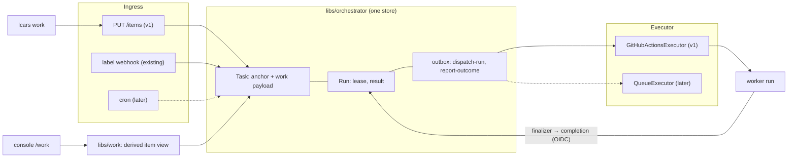
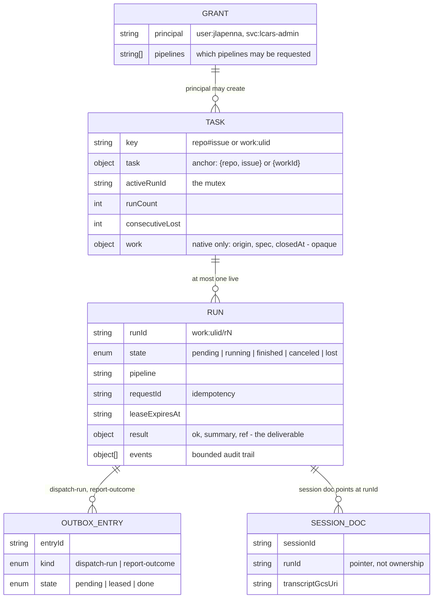
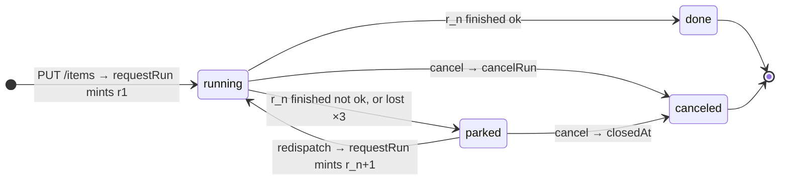
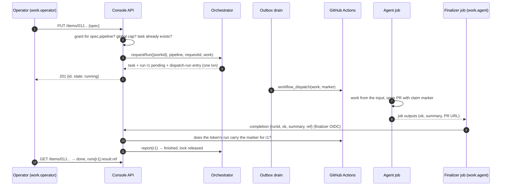
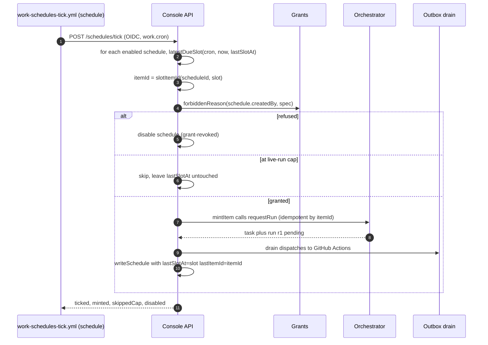
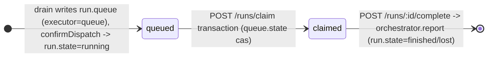
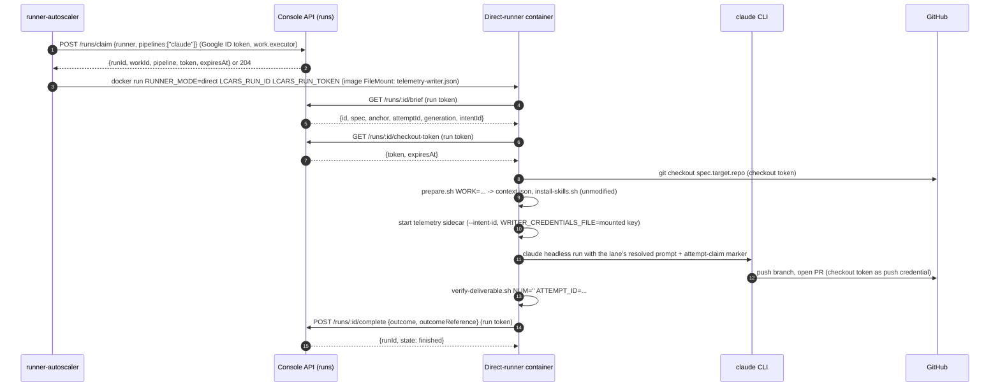
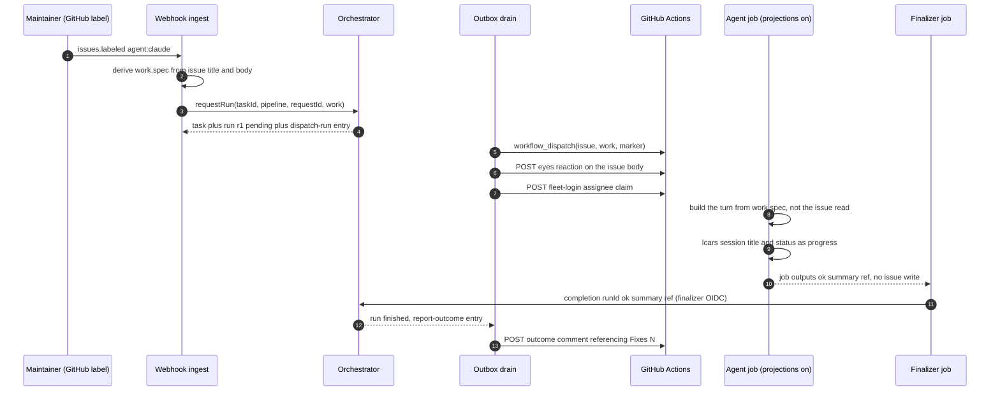
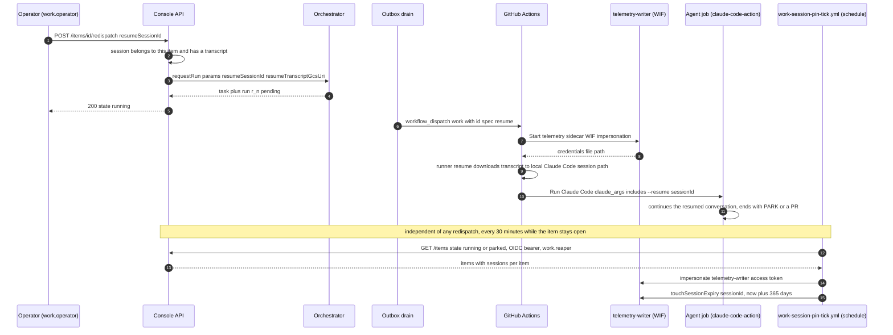

# Native work items: a GitHub-independent task system

- **Status:** Approved design, pre-implementation
- **Date:** 2026-08-23 (rewritten 2026-08-25 on the one-store model)
- **Scope:** Design for the whole program; implementation scope for
  sub-project 1 only (see [Sequencing](#sequencing)).

## Problem

GitHub is currently the fleet's only ingress, its only task store, and its
only execution queue. A task _is_ a GitHub issue (`libs/orchestrator`'s
`TaskId = {repo, issue}`), dispatch _is_ a label webhook, execution _is_ a
`workflow_dispatch` onto GitHub Actions, and the human-interaction surface
(parking, outcome comments, redispatch triggers) lives on issue threads.
That blocks two wanted capabilities:

1. **Agent-initiated work** — an agent (interactive session, fleet member,
   or service) asking LCARS to do work directly, with no human touching
   GitHub. This is the driving use case.
2. **Scheduled/recurring work** — cron-style self-originated tasks.

It also makes runner execution inseparable from GitHub Actions queues, which
the fleet wants as an eventual, swappable backend rather than a load-bearing
assumption.

## Why this shape

The first draft of this spec kept a new `WorkItem` store beside the
orchestrator's `Task` and synchronized the two. Review found that every
piece of machinery it grew — an `admit` outbox kind, an idempotency
reservation collection, a repair sweep, a "projection" rule for item
state, a `cancel-run` kind, a second run-facing API — was a patch for that
one split, and that its justification ("the orchestrator stays unchanged")
did not hold. This rewrite has **one store**: the orchestrator's `Task` is
the work item, item state is **derived** from its runs, and runs keep using
the control-plane surface they already have.

## Decisions

| Question                       | Decision                                                                                                                                                                                                                                                                          |
| ------------------------------ | --------------------------------------------------------------------------------------------------------------------------------------------------------------------------------------------------------------------------------------------------------------------------------- |
| First end-to-end consumer      | Agent-initiated work via API                                                                                                                                                                                                                                                      |
| Structure                      | One store. The orchestrator's `Task` carries an opaque `work` payload for native anchors; `libs/work` is schemas, a derived view, and route handlers                                                                                                                              |
| Item state                     | Derived from the task and its latest run, never stored — except `closedAt`, an orchestrator-owned Task field written by a `closeTask` decision                                                                                                                                    |
| Deliverable                    | `Run.result` (`ok`, `summary`, `ref`) — already the orchestrator's shape; `ref` is the PR URL. Typed multi-results are a deferred extension                                                                                                                                       |
| GitHub's role for native tasks | None required. Native-first: console + API are the interaction surface                                                                                                                                                                                                            |
| API                            | Resource-oriented REST (`items`) + `lcars work` CLI; runs report through the existing hosted completion route, generalized to the anchor union. There is no renew route today and v1 adds none: the 2 h lease is the run budget, as it is for label-driven work                   |
| API framework                  | **oRPC 2** (decided 2026-08-25; `2.0.0-beta.31` on the `beta` dist-tag today, stable 1.15.0), contract-first — the fleet-wide pick shared with sprinkles#4837. Contract in `libs/work`, `@orpc/next` handler in the console, typed client in `lcars`, OpenAPI as a build artifact |
| Console callers                | The same procedures exposed as Next server functions (`@orpc/next`'s `createServerFunctionable`) with the Auth.js session as the principal source — no second handler set for the UI                                                                                              |
| Create                         | `PUT /items/{ulid}` with a client-generated ULID: read the task first (exists → `200`), else one `requestRun` transaction that also creates the task with its `work` payload                                                                                                      |
| Auth                           | OAuth2 resource server with two additive scopes: `work.operator` (grant list) and `work.agent` (GitHub Actions OIDC). Standard library, issuers as configuration                                                                                                                  |
| v1 human issuer                | Google via per-user service-account impersonation (a Google _user_ credential cannot mint an audience-scoped ID token); LCARS-minted tokens with sub-project 4                                                                                                                    |
| Pipeline selection             | `spec.pipeline` required; the grant list says which pipelines each principal may request — not every agent may trigger Claude                                                                                                                                                     |
| Admission                      | One global live-run cap, sized to runner capacity; `429`                                                                                                                                                                                                                          |
| Spec delivery                  | One `work` JSON `workflow_dispatch` input (`{ id, spec }`) in v1 — the workflows already use 8 of GitHub's 10 inputs; the direct-runner backend fetches via API later                                                                                                             |
| Execution                      | `Executor` seam at the outbox; GitHub Actions is backend 1, a direct-runner queue is backend 2                                                                                                                                                                                    |
| Sessions                       | Derived: the telemetry session doc already points at `runId`. Resume + lifecycle-pinned persistence are sub-project 6                                                                                                                                                             |
| Protocol end state             | Agents become GitHub-issue agnostic and use only the run-facing routes; issue-side affordances become control-plane projections (sub-project 5)                                                                                                                                   |

## Architecture



Invariants:

- The orchestrator remains a per-task mutex with an audit trail. It stores
  the `work` payload the way it stores `params`: opaque, never interpreted.
- `libs/work` depends on `libs/orchestrator`, never the reverse, and holds
  no state of its own.
- A run reports through the hosted control-plane routes it already uses.
  If the direct-runner backend later needs more (spec fetch), that becomes
  a route; nothing in v1 is added to the worker surface that GitHub Actions
  alone would need.

## Data model



### `Task` (existing, anchor-aware)

`TaskId` becomes a union of two shapes: the existing `{ repo, issue }`,
kept byte-for-byte as persisted today, and `{ workId }`. The variants are
discriminated by which key is present — never by a new required field,
because `FirestoreStore` zod-parses every persisted document on read and a
required field would reject the whole existing dataset. `taskKey()` emits
`repo#issue` (unchanged) or `work:<ulid>`; `:` is outside the repo-name
charset, so keys cannot collide. Zero migration.

A native task additionally carries `work`, opaque to the orchestrator.
Concretely: `taskSchema` gains an optional `work` field (strict zod,
bounded) and `RequestRunInput` gains `work?`, used only when the request
creates the task — `params` stays a per-run string record and is not
where `work` goes:

- `origin` — `{ principal, channel: 'api' | 'cron' | 'console' }`. The
  principal is LCARS-native (`user:jlapenna`, `svc:lcars-admin`), never a
  raw issuer subject.
- `spec` — `{ title, description, pipeline, target: { repo } }`. All
  bounded strings, strict zod. `pipeline` is required; `target.repo` is
  required while GitHub Actions is the only backend (an item no backend can
  launch is rejected). No `mode` — a review is a task whose description
  says so.
- `closedAt?` — the one piece of stored item state, and it is
  **orchestrator-owned**: a new `closeTask` decision in `decide.ts` sets it
  transactionally, refusing if a run is live, and `requestRun` refuses a
  closed task (`task-closed`). `libs/work` never writes the task document
  directly, so cancel and redispatch cannot race into "canceled with a live
  run".

### `Run` (existing, unchanged shape)

One execution. `result = { ok, summary, ref }` is already the deliverable
record; for native work `ref` is the PR URL. `requestId` is the
idempotency key the orchestrator already honors.

### Derived item state

Nothing stores an item state. `libs/work` derives it from the task (for
`closedAt` and the retry budget) and its latest run, first match wins:

| Condition                                                       | State      |
| --------------------------------------------------------------- | ---------- |
| `closedAt` set, or latest run `canceled`                        | `canceled` |
| a run is live (`pending` / `running`)                           | `running`  |
| latest run `finished` with `ok: true`                           | `done`     |
| latest run `finished` with `ok: false`                          | `parked`   |
| latest run `lost` and `task.consecutiveLost > MAX_AUTO_RETRIES` | `parked`   |
| latest run `lost` otherwise (the sweep will mint the retry)     | `running`  |



A budget-exhausted run stays `lost` with no `result` — nothing rewrites it
to a failure — which is why the derivation reads the task's
`consecutiveLost` rather than looking for `ok: false`.

### Sessions

Telemetry already stores each agent session at `sessions/{sessionId}`
with a `runId` pointer — but that `runId` is the **GitHub Actions run id**
(`RUN_ID: ${{ github.run_id }}` in the lane), not the orchestrator's. v1
adds the orchestrator run ID to the session doc as `intentId`: the lane
already receives it as `broker_intent_id` and passes it to the telemetry
sidecar as one more env var. Item → runs → sessions is then a query on
`intentId`, not a link. The
relationships: Task 1→N Run (sequential, mutex-enforced); Run↔Session N:M
over time — a run has one primary session, an interactive takeover
continues a session past its run, and (sub-project 6) a later run may
resume an earlier one. Session **resume** and lifecycle-pinned
**persistence** are one feature and arrive together: `redispatch` gains
`resumeSessionId`, and a session pointing at any run of an open item is
exempt from `expireAt` reaping until the item settles.

### Collections and writers

| Collection             | Written by                                                                                           |
| ---------------------- | ---------------------------------------------------------------------------------------------------- |
| `tasks/{key}`          | Orchestrator transactions. `work.closedAt` is the one field `libs/work` writes, via the cancel route |
| `runs/{runId}`         | Orchestrator transactions (request, dispatch, renew, report, sweep)                                  |
| `outbox/{entryId}`     | Orchestrator decisions; the drain leases and settles                                                 |
| `sessions/{sessionId}` | Telemetry sidecar; untouched                                                                         |
| grants                 | Configuration                                                                                        |

## API

Resource-oriented REST under `apps/console/src/app/api/work/v1/`. The
Edge proxy (`apps/console/src/proxy.ts`) returns `401` for any `/api`
path not in its allow-list before any handler runs, so `/api/work/v1/`
goes into `publicPrefixes` (#1232 shipped a control-plane route without
its entry; #885 is the fix that made the gap observable). That hands the
whole catch-all tree to the handler's own auth, and the on-disk route scan
in `proxy.test.ts` sees one `route.ts` regardless of how many procedures
it serves — so the auth middleware is applied at the **router** level to
the `items` router, and a contract test walks every procedure in the
router asserting the auth middleware is present (v2 no longer
deduplicates middleware automatically, so a stray unguarded procedure is a
realistic mistake).

### Framework: oRPC 2, contract-first

The fleet's one API framework (decided with sprinkles#4837): **oRPC 2**.
Today that is `2.0.0-beta.31` on the `beta` dist-tag (stable is 1.15.0);
the fleet adopts the 2.x line deliberately rather than 1.x, because v2
changed the wire format — a v1 client cannot talk to a v2 server — and
starting on 1.x would mean a coordinated server-and-client migration
later. Renovate tracks the dependency to its stable release like any other
third-party package. Each repository adopts it independently; nothing is
shared as source.

What v2 means concretely (from the v1→v2 migration guide):

- **Packages:** `@orpc/contract`, `@orpc/server`, `@orpc/client`,
  `@orpc/openapi` (which absorbed `openapi-client`), `@orpc/next`
  (which absorbed `@orpc/react`), and `@orpc/zod` for JSON-schema
  conversion. **Zod v4 is required** — the console is on 4.4.3.
- **Routing is OpenAPI metadata:** `oc.meta(openapi({ method: 'PUT',
path: '/items/{id}' }))` on the contract; `.route`/`.prefix`/`.tag` no
  longer exist.
- **Contract** lives in `libs/work` beside the schemas, dependency-light
  and free of `server-only` imports so the CLI can import it (the same
  discipline `dispatch-contracts` follows for `'use client'` bundles).
- **Handler:** one catch-all route,
  `apps/console/src/app/api/work/v1/[[...rest]]/route.ts`, serving an
  `OpenAPIHandler` from `@orpc/openapi/fetch`. The per-request **context** is where
  auth lives: it accepts either a bearer token (Google service-account or
  GitHub Actions OIDC, verified as below) _or_ an Auth.js session
  (`auth()`), and maps both to one principal + scopes. Middleware is
  guarded with v2's context-flag pattern (automatic deduplication is
  gone), and HTTP statuses for errors are the handler's `errorStatusMap`.
- **Console pages** call the same procedures as **server functions** —
  `createServerFunctionable({ context })` from `@orpc/next` — with the
  session as principal, `user:<github-login>`, instead of a second
  handler set.
- **Clients:** `lcars work` uses the typed contract client
  (`@orpc/client` + `OpenAPILink` from `@orpc/openapi`); agents and
  scripts use the generated OpenAPI document with `curl`; a later MCP
  wrapper is generic tools over the same contract, as sprinkles plans.
- **Migration-off path**, since v2 is still beta: the contract is plain
  zod plus route metadata, so replacing the framework is mechanical.
  Existing hand-rolled control-plane routes are not migrated in v1.

### `items` — issuing and following work (`work.operator`)

| Route                        | Purpose                                                                                                                                                                                                                                                                                                                                                          |
| ---------------------------- | ---------------------------------------------------------------------------------------------------------------------------------------------------------------------------------------------------------------------------------------------------------------------------------------------------------------------------------------------------------------- |
| `PUT /items/:id`             | Create. `:id` is a client-generated ULID; the body is `spec`. Read the task first: if `work:<id>` exists, `200` with the existing item and no `requestRun` — the orchestrator's `duplicate-request` only covers the window while r1 is live, so a replay after r1 settles must not mint r2. Else `requestRun({ workId }, pipeline, requestId: id, work)`, `201`. |
| `GET /items/:id`             | Derived state, spec, origin, runs (with results), and the sessions telemetry holds for those runs.                                                                                                                                                                                                                                                               |
| `GET /items`                 | List/filter by state, principal, target repo.                                                                                                                                                                                                                                                                                                                    |
| `POST /items/:id/cancel`     | Derived `done` or `canceled` → `409`. Live run → `cancelRun`. `parked` → `closeTask`.                                                                                                                                                                                                                                                                            |
| `POST /items/:id/redispatch` | `parked` only → `requestRun` with the same `work` and a fresh `requestId`; `409` otherwise. The reply-trigger analog.                                                                                                                                                                                                                                            |

Idempotent create is the standard client-ID PUT: because the ID is
client-generated, the only concurrent replayer is the same client, so
read-then-request is acceptable and `duplicate-request` covers the
in-flight window. The global live-run cap is likewise check-then-act;
it is advisory, bounded by request concurrency, and sized with slack. Admission is checked before `requestRun`: a
principal without a grant for `spec.pipeline` gets `403`; a fleet at the
global live-run cap gets `429` with `Retry-After`. Status is poll-only in
v1 (`lcars work status --watch` polls).

### Runs — the existing completion route, generalized (`work.agent`)

The one hosted route a run's workflow uses today is **completion**, and
only the isolated fallback-finalizer job may call it — `job_workflow_ref`
is pinned to `agent-fallback-finalize.yml`, and the agent job never posts
to it. That stays exactly so: the agent job's `id-token: write` must not
become a way for a dispatched (or prompt-injected) agent to certify its own
run as `ok` before `verify-deliverable` and the finalizer have run. The
finalizer posts `{ runId, ok, summary, ref }` from the agent job's outputs,
as it posts the outcome today.

| Route (existing) | Change for native anchors                                                                                                                                       |
| ---------------- | --------------------------------------------------------------------------------------------------------------------------------------------------------------- |
| completion       | Body always names the run by `runId`; `issue` stays for GitHub anchors. The run's `task` may be either anchor shape. `{ ok, summary, ref }` is the deliverable. |

There is no renew route and no worker calls one — `Orchestrator.renew`
exists but only tests invoke it. The 2 h `LEASE_MS` is therefore the run
budget for label-driven work today, and native work inherits the same
budget. A renew route (callable from the agent job, with its own
`job_workflow_ref` pin to `agent-lane.yml`) is added only when runs need
longer, not in v1.

The spec reaches the agent as one `work` JSON `workflow_dispatch` input,
`{ id, spec }`: the workflows already declare 8 of GitHub's 10 allowed
inputs, so two new ones would exhaust the limit. `spec.description` is
bounded to 16 KiB so the input fits the 65,535-character budget with
`reply`/`context` empty. Session status and progress use the channel that
already exists (`lcars session title` / status annotations); the item's
page shows them through the `intentId` join.

### One request, end to end



Step 3 is the only decision, and it is the transaction the orchestrator
already performs for label dispatch. Nothing is projected afterwards.

## Auth

The API is a plain OAuth2 resource server (RFC 6750 bearer tokens): verify
the JWT against the issuer's OIDC discovery + JWKS with `jose` (already
used by `github-actions-oidc.ts`, one cached JWKS per issuer), check
audience, apply the entry's claim predicates, map to a principal and
scopes. An Auth.js session is a third source for browser and server-action
callers, mapped to `user:<github-login>` with `work.operator`. Scopes are
additive; sources confine which scopes they may confer.

| Scope           | Confers                              | Issuer (v1)                             | Principal                |
| --------------- | ------------------------------------ | --------------------------------------- | ------------------------ |
| `work.operator` | The `items` routes, per grant list   | Google — service-account identity       | mapped from the SA email |
| `work.agent`    | The completion route for its own run | GitHub Actions OIDC, finalizer job only | `agent:run/<runId>`      |

- **Grant list.** Configuration: `{ principal → pipelines[] }`. A
  principal absent from it has no scope; one requesting a pipeline outside
  its list gets `403`. This is the whole authorization model — there is no
  admin scope in v1 because no admin-only route exists; the maintainer acts
  through the console's existing auth wall. An agent acting as the fleet's
  administrator is just a service-account principal with a broad grant.
- **Google, via impersonation.** A Google _user_ credential cannot mint an
  ID token for an LCARS-chosen audience (`gcloud auth print-identity-token
--audiences` refuses non-service accounts), and accepting Google's public
  client audiences would make every ID token the user mints for any other
  service a valid LCARS bearer. So each human impersonates a per-user
  service account (`--impersonate-service-account … --audiences <lcars>
--include-email`; one IAM Token Creator binding per user under the usual
  Terraform approval), and the `lcars` CLI hides it. Chosen because it is
  free today, not because it is contractual: moving to another IdP, or to
  LCARS-minted tokens (sub-project 4), is a configuration entry.
- **GitHub Actions, with predicates.** Signature, issuer, and audience are
  not sufficient — any repository can mint a token requesting our audience.
  The existing predicates apply unchanged: `repository` in the
  control-plane allow-list, `ref` is `refs/heads/main`, `event_name` is
  `workflow_dispatch`, `workflow_ref` claim-relative to the worker workflow
  files, and `job_workflow_ref` pinned to the fallback finalizer. Nothing
  in v1 accepts a token minted inside the agent job.
- **Binding a token to its run.** The predicates prove "a trusted worker on
  an allowed repository", not "the worker for _this_ run". The run routes
  therefore verify that the Actions run named by the token's own
  `(repository, run_id)` has a `display_title` dispatch marker whose
  `intentId` is the `runId` in the body — the deterministic join
  `orchestrator-terminal-runs.ts` already uses. One GitHub API call, no
  stored binding state. This replaces the completion route's current
  `run.task.issue === body.issue` tie, which cannot hold for a native
  anchor, and applies to both anchor kinds. It puts one GitHub API call on
  the settle path, so its failure mode is stated: **fail closed**. A GitHub
  error refuses the completion with `503`, the finalizer retries with
  backoff (a change to the finalizer, which posts once today), and the
  existing terminal-run probe — already GitHub-dependent, already run by
  every reconcile — settles a run whose job has ended in the meantime. An
  outage delays settlement; it never settles a run on an unverified token.
- **One human, one principal.** A grant entry carries the subjects that
  map to it — `{ principal: 'user:jlapenna', subjects: ['<sa email>',
'github:jlapenna'], pipelines: [...] }` — so the same person is the same
  principal whether they arrive by impersonated service account or by
  Auth.js session.

## Execution abstraction

The seam is the outbox: a `dispatch-run` entry is handed to an
**`Executor`** — `dispatch(run, task)` — selected per anchor. Cancel is
what it is today: `cancelRun` settles the run and the job's later calls are
refused; nothing reaches into Actions.

### Backend 1 (v1): `GitHubActionsExecutor`

Today's `workflow_dispatch` drain
(`apps/console/src/lib/orchestrator-dispatch.ts`) as the first
implementation. GitHub Actions remains the queue and credential broker in
v1 — deliberately, since the driver is agent-initiated _ingress_, not
runner independence. The repository comes from `anchorTarget(task)`: the
anchor's `repo` for GitHub, `work.spec.target.repo` for native. The same
helper replaces the other `task.repo` / `task.issue` reads
(`orchestrator-routes.ts`, `orchestrator-terminal-runs.ts`), and
`FirestoreStore.listRuns` gains an anchor-aware query — the store contract
spec covers both anchors and runs against the Firestore emulator in CI
(today its Firestore half is skipped there).

The worker workflows are issue-anchored at every layer — `issue` is a
required input, both jobs are gated on it, `run-name` embeds it, the lane
reads it in roughly ten steps, and the fallback finalizer pipes it through
`tonumber`. The native path:

- `issue` becomes optional; one `work` JSON input is the alternative
  anchor, and the job gates accept either.
- `run-name` and the dispatch marker use `work:<ulid>/r<n>`; the marker
  grammar (`libs/dispatch-contracts/src/marker.ts`) gains that form, pinned.
- Each issue-reading lane step gets a native branch: the prompt is built
  from the `work` input, the sidecar receives `broker_intent_id` as
  `INTENT_ID`, `verify-deliverable` checks for the PR with this run's
  claim marker (as today), and the finalizer posts completion by `runId`.
- `report-outcome` for a native anchor posts nothing to GitHub; the item's
  state is already derivable. (`ref` is dispatched as `main`; there is no
  `target.ref` in v1.)

### Backend 2 (later): `QueueExecutor`

The actual de-GitHub-ing, as its own sub-project. LCARS keeps a claimable
run queue (Firestore, the outbox's lease/fencing pattern); the
runner-autoscaler polls it and launches the same runner image in "direct"
mode, where a bootstrap claims a run, fetches the spec through a new route,
runs the agent CLI, and reports through the same run routes. Runner
identity becomes an LCARS-minted per-run token.

## Dispatched-agent protocol in native mode

`agent-protocol` is written against an issue. v1 adds a short **native
mode** section mapping each issue-side action; label-driven behavior is
untouched.

| Protocol section                 | Issue mode (today)                   | Native mode (v1)                                                                                        |
| -------------------------------- | ------------------------------------ | ------------------------------------------------------------------------------------------------------- |
| 1. Takeover comment              | Comment naming the resume command    | Nothing to post: the session doc names the session; the console renders the takeover affordance from it |
| 2. Eyes-reaction acknowledgement | 👀 on the issue                      | Implicit: dispatch confirmation moves r_n to `running`                                                  |
| 3. One edited progress comment   | Single comment, edited in place      | `lcars session title` / status — the existing channel                                                   |
| 4. Parking                       | `status:needs-human` label + comment | Completion with `ok: false` and the summary; the item reads `parked`                                    |
| 5. Deliverable rule              | PR carrying the attempt-claim marker | Same PR and marker; `ref` in the completion body                                                        |
| 6–12. Everything else            | unchanged                            | unchanged                                                                                               |

PRs from native tasks are authored by the same bot logins, so
`agent-automerge.yml` treats them identically; the PR body references
`Work: work:<ulid>` rather than `Fixes #N`.

**End state.** Native mode is transitional. Once sub-project 5 makes
label-driven work carry a `work` payload too, every issue-side affordance
becomes a control-plane projection written by the drain, and the
agent-facing contract is the run routes alone.

## Console

Two pages behind the existing auth wall: `/work` — the derived list, parked
first; `/work/[id]` — spec, runs with results, sessions, and the two
actions (cancel, redispatch).

## Error handling

Inherited: idempotent create; `duplicate-request` for in-flight replays;
outbox lease retry for dispatch failures; lease expiry → bounded auto-retry
→ `parked` by derivation. New surface follows house style: strict zod,
bounded strings, fail-closed validation. `403`/`429` are the only
synchronous refusals besides validation.

## Testing

- Store contract spec against memory and Firestore stores, the Firestore
  half now running against the emulator in CI; persisted-shape fixtures for
  the anchor union.
- Derived-state table-driven spec; route tests with stubbed tokens; claim
  predicate specs including per-job `job_workflow_ref` pins; proxy
  allow-list scan extended to `api/work/v1`.
- Workflow contract test for the optional `issue` / `work_id` gates; pinned
  marker grammar and `work:` key formats.
- The generated OpenAPI document checked in and diffed in CI, so a contract
  change is a visible review artifact.
- No real git in unit tests. Console E2E stays off while paused (#1049);
  the real-path proof is one native task dispatched end-to-end producing a
  PR on a test repo.

## Sequencing

1. **v1 (this spec):** adopt oRPC 2 (`beta` dist-tag); anchor union + `work` payload + `anchorTarget` +
   anchor-aware store; `items` routes, grant list, cap, OAuth2 gate with
   per-job pins and marker binding; generalized completion with marker binding and finalizer retry;
   `intentId` on session docs; native lane path; `lcars work`; two console pages; native-mode protocol
   section.
2. **Parked-work visibility + console polish** (see the section below; the
   Telegram paging originally listed here was dropped on 2026-08-27 — the
   console is the notification surface).
3. **Cron ingress:** a scheduler minting items from a schedule — see
   [Sub-project 3: cron ingress](#sub-project-3-cron-ingress).
4. **`QueueExecutor`:** direct runner mode + LCARS-minted run tokens +
   spec-fetch route — see
   [Sub-project 4: QueueExecutor](#sub-project-4-queueexecutor).
5. **Ingress unification:** label-driven work and Quick Tasks carry `work`;
   issue affordances become projections; the protocol collapses to the run
   routes — see
   [Sub-project 5: ingress unification](#sub-project-5-ingress-unification).
6. **Session resume and persistence:** `redispatch` may resume a prior
   run's session, and a session pointing at an open item's run is exempt
   from `expireAt` reaping until the item settles — see
   [Sub-project 6: session resume and persistence](#sub-project-6-session-resume-and-persistence).

## Deferred extensions

Added when something needs them; nothing above precludes them:

- Typed multi-results (`report`, `artifact`, `message`) beyond
  `Run.result`.
- Operator-attached links/evidence on an item.
- Per-principal caps, an admin scope, and `grants` as a resource (the
  trigger: an admin agent that must manage grants through the API).
- Streaming status; MCP transport; `target.ref`.

## Non-goals (v1)

- Migrating GitHub-anchored tasks or Quick Tasks.
- Targetless items; a review dispatch mode; a default pipeline.
- External notifications (Telegram or otherwise) for parked work: the
  console's own attention surfaces carry parked items (sub-project 2).
- Any change to the dispatched-agent protocol for label-driven work.
- Any issuer beyond Google (service-account identity) and GitHub Actions.

## Sub-project 2: parked-work visibility and console polish

Added 2026-08-27 after sub-project 1 shipped (#1527, #1531, #1532, #1534).
Maintainer ruling: no Telegram (or any external) paging — the console is the
place a maintainer already looks, so parked native work must be visible
there without navigating to `/work`. Everything below is console-only; no
new secrets, Terraform, or runtime env vars.

### Parked work on the Bridge

The Bridge (`/`) gains a **Parked work** panel above the agent activity
panel, rendered only when at least one native item derives `parked`. It
reads the same `listItems` server function the `/work` page uses (so it
inherits the `work.operator` grant check: a signed-in admin without a grant
sees no panel, not an error), filters `state === 'parked'`, and lists each
item as a row: title (linking to `/work/<id>`), target repo, the latest
run's `result.summary` (the outcome kind), how long it has been parked
(`updatedAt`), and the existing `WorkActions` (redispatch / cancel). Sorted
oldest-parked first. This is the "notification": a parked item is on the
first page the maintainer opens until it is redispatched or canceled.

### `/work` in the primary navigation

`work` becomes a `CONSOLE_DESTINATIONS` entry (`/work`, label **Work**,
accent `violet` — the one accent not yet used by a destination), between
Shuttlebay and Sessions. The tablet-width constraint that kept it out in
sub-project 1 (a 768 px viewport must not scroll horizontally on any page —
`apps/console-e2e/src/mobile-header-every-page.spec.ts`) is met by the
existing `.lcars-nav { flex-wrap: wrap }`; the E2E view list gains
`/work`. The page-shell `current` value `'work'` already exists.

### Creating items from the console

`/work` gains a create form (title, description, target repo defaulting to
the control-plane repository, pipeline select over `PIPELINES`). It calls a
new `createItem` server function wrapping `workRouter.create` — the same
handler the API uses, so grants, the live-run cap, and validation apply
unchanged; `origin.channel` is `console`. The client generates the ULID
(`libs/work/src/ulid.ts`, Crockford base32 over `crypto.getRandomValues`)
so a retry of the same submission is idempotent. On `201` the page navigates
to `/work/<id>`; `FORBIDDEN` and `TOO_MANY_REQUESTS` render inline as
"no grant for that pipeline/repo" and "live-run cap reached".

### Native runs on the existing surfaces (#1530)

Two places derive a run's anchor from `#<n>:` in the Actions display title
and get `undefined` for `native work: …` titles:

- **Attribution.** `ExecutionAttempt` already carries `intentId` from the
  dispatch marker. A `workIdFromIntentId(intentId)` helper
  (`work:<ulid>/r<n>` → `<ulid>`) lets the agent activity panel link a native
  attempt to `/work/<ulid>` instead of the bare Actions run URL; the
  attempt stays in the "unattributed" group of `deriveLogicalWork` (that
  grouping is by GitHub task and is out of scope), but it is no longer
  anonymous.
- **Cancel from the runs view.** `notifyReconcileForCancelledRun` resolves
  the anchor from the marker when the title has no issue number: the marker's
  `intentId` is the orchestrator run id, so `reflectCancelledRunInOrchestrator`
  takes `{ issue }` or `{ runId }` and cancels by run id directly, then sweeps.

### Testing

Unit: nav destination list + header current-marking; `ulid()` shape and
uniqueness; create form (submits `{ id, spec }`, renders the two refusal
messages); parked panel (hidden at zero, rows sorted oldest first, actions
wired); `workIdFromIntentId`; cancel path with a native display title
(orchestrator `cancel` called with the intentId, no issue lookup). E2E:
`/work` joins `mobile-header-every-page`. Real path: after rollout, one
native item is created and driven to `parked` (its description asks the
agent to `PARK`) and the Bridge is checked by the maintainer; `get` via
`work-create.yml` shows `parked`; `redispatch` is exercised from the panel.

## Sub-project 3: cron ingress

**Purpose.** Recurring native work: an operator declares a cron expression
and a spec once, and a scheduled tick mints a work item for each due slot.
No new store and no new dispatch mechanism — the tick reuses `items`'
create path exactly (grants, the live-run cap, idempotent minting) via a
`mintItem` primitive extracted from `items.create`'s body. Requires
sub-project 2 (console polish) merged, for `libs/work`'s `ulid()`.

### Resource: `schedules`

`/api/work/v1/schedules`, the same `work.operator` auth every `items`
route uses, with one exception:

| Route                          | Scope           | Purpose                                                                                                                           |
| ------------------------------ | --------------- | --------------------------------------------------------------------------------------------------------------------------------- |
| `PUT /schedules/{id}`          | `work.operator` | Create. `{id}` a client ULID; body `{ cron, spec, enabled? = true }`. 201-always, idempotent by id (same rule as `items.create`). |
| `GET /schedules/{id}`          | `work.operator` | Read one schedule.                                                                                                                |
| `GET /schedules`               | `work.operator` | List, newest first, `limit`.                                                                                                      |
| `POST /schedules/{id}/enable`  | `work.operator` | Re-enable a disabled schedule; clears `disabledReason`.                                                                           |
| `POST /schedules/{id}/disable` | `work.operator` | Disable; sets `disabledReason: 'operator'`.                                                                                       |
| `POST /schedules/tick`         | `work.cron`     | Mint items for every enabled schedule's latest due slot. Not an operator route — see Auth below.                                  |

### Schedule document

Strict zod, stored opaquely by a new `ScheduleStore` (`libs/orchestrator`)
exactly the way `Task.work` is opaque to the orchestrator itself — `spec`
is a bounded record at the store layer, validated as `workSpecSchema` by
`libs/work` on every read and write:

```
{ scheduleId: WORK_ID_RE, cron: string, spec: WorkSpec,
  enabled: boolean, createdBy: principal string,
  createdAt, updatedAt,
  lastSlotAt?: ISO, lastItemId?: WORK_ID_RE,
  disabledReason?: 'grant-revoked' | 'operator' }
```

`ScheduleStore`: `readSchedule`, `writeSchedule` (create-or-replace,
last-write-wins — a schedule is configuration plus a watermark, not a
mutex over live work like `Task`), `listSchedules(limit)`,
`listEnabledSchedules()`. Memory and Firestore implementations, collection
`${prefix}schedules` beside `${prefix}tasks`/`runs`/`outbox`, the
Firestore half run against the same CI emulator `items`' store contract
already uses.

### Cron grammar

5-field (`min hour dom mon dow`), UTC only, `*`, lists, ranges, `*/n`
steps, minute granularity — no third-party dependency
(`libs/work/src/cron.ts`; third-party deps are root-only and need
Renovate). All five fields are ANDed (deliberately not POSIX's
dom-OR-dow special case, where restricting both day-of-month and
day-of-week ORs them instead). `parseCron(expr)` throws on anything
malformed. `latestDueSlot(spec, now, after?)` returns the latest minute
boundary `<= now` that matches and is strictly after `after`, or
`undefined`. `nextDueSlot(spec, from, horizonDays = 366)` searches
forward instead, and is what schedule creation uses: a syntactically
valid expression that can never actually fire (e.g. `0 0 31 2 *`, since
no February has a 31st) is rejected at create time with `400`, rather
than sitting enabled and costing a full lookback walk on every tick
forever.

### Tick semantics

`work-schedules-tick.yml` calls `POST /schedules/tick` every 5 minutes
with an empty JSON body. Creation seeds `lastSlotAt` to the creation
instant, so a schedule's first slot is the first boundary after its
creation. For each enabled schedule:

1. `slot = latestDueSlot(cron, now, schedule.lastSlotAt)`. No slot → skip;
   `lastSlotAt` untouched.
2. `itemId = slotItemId(scheduleId, slot)`: the 10-char ULID time prefix
   of `slot.getTime()` plus 16 Crockford characters derived from
   `sha256(scheduleId + ':' + slot.toISOString())` (each of the digest's
   first 16 bytes mapped through `byte % 32`). Deterministic — a re-tick
   of the same slot (a retry, or two ticks racing before `lastSlotAt`
   advances) always names the same item, so minting goes through
   `mintItem`'s idempotent-create path rather than starting a second run.
   A missed slot is never backfilled: only the latest due slot is minted
   each tick, and an older one is silently superseded.
3. Grants are re-checked at mint time against the schedule's `createdBy`
   principal — never the tick caller's own `cron:tick` identity, which
   carries no grant of its own — using the same `forbiddenReason` rule
   `create` and `redispatch` already apply. A refusal disables the
   schedule (`disabledReason: 'grant-revoked'`) instead of retrying a
   refusal every 5 minutes forever.
4. The live-run cap applies. At the cap, this schedule is skipped for
   this tick and `lastSlotAt` does **not** advance — the same slot is
   retried on the next tick until it mints or a newer slot supersedes it
   (`latestDueSlot` always resolves to the _latest_ due slot, never a
   queue of missed ones).
5. On a mint (new or idempotently replayed), `lastSlotAt = slot` and
   `lastItemId = itemId`.

Origin on the minted item: `{ principal: 'cron:<scheduleId>', channel:
'cron' }` — the `'cron'` channel `workOriginSchema` already reserved.
Response: `{ ticked, minted: [{scheduleId, itemId}], skippedCap: [...],
disabled: [...] }`, `ticked` the count of enabled schedules considered.

`mintItem(context, { id, spec, origin, grantsPrincipal })` is extracted
from `items.create`'s body so both paths run the identical
existing-item / `CONFLICT` / cap / `request` / `drain` sequence; the only
difference between a client-driven create and a tick-driven mint is which
principal's grant is checked and where the id comes from.

### Auth for the tick

`POST /schedules/tick` has no human or service-account caller — only the
scheduled workflow. A new scope `work.cron` (beside `work.operator`) is
granted by GitHub Actions OIDC alone:
`assertScheduleTickOidcClaims`/`verifyScheduleTickOidcToken` in
`github-actions-oidc.ts` mirror the reconciler's pair — audience
`agent-lcars-work-schedules`, repository pinned to the control-plane home
(not the allow-list, like the reconciler), `ref: refs/heads/main`,
`event_name` in `{schedule, workflow_dispatch}`, `job_workflow_ref`
pinned to `.github/workflows/work-schedules-tick.yml@refs/heads/main`.
`authenticateWorkRequest` grows a third branch: a bearer that fails Google
verification is tried against this verifier before the request is
refused, producing `{ principal: 'cron:tick', via: 'oidc', scopes:
['work.cron'] }`. No grant-list entry for `cron:tick` itself — `work.cron`
confers nothing but tick access, and the tick re-checks every schedule's
own `createdBy` grant per schedule.

### Console

`/work/schedules` (session-gated like `/work`, `current: 'work'`): a table
(title, cron, pipeline, repo, enabled, last item linking to `/work/<id>`),
a create form (title, description, repo defaulting to the control-plane
repository, pipeline select, a cron field validated client-side with the
same `parseCron`), and enable/disable buttons as server functions — the
same `createServerFunctionable` pattern `/work`'s cancel/redispatch
already use. `/work`'s header links to it. No CLI changes in this
sub-project; the API and console suffice.

### Testing

Cron evaluator table tests (every operator, invalid expressions throw);
`slotItemId` determinism against `WORK_ID_RE`; `ScheduleStore` contract
against memory and the Firestore emulator; router tests for
create/get/list/enable/disable and for the tick (not due, due plus
idempotent re-tick, cap-skip leaving `lastSlotAt` untouched,
grant-revoked disabling); OIDC claim tests mirroring the reconciler's;
console page/form tests; a workflow text-assertion test for
`work-schedules-tick.yml`'s cadence, trigger, minimal permissions, and
target; the OpenAPI document regenerated and diffed in CI as it already
is for `items`. `/api/work/v1/` is already the whole prefix's proxy
allow-list entry (`proxy.ts`) — the tick route needs no proxy change.



## Sub-project 4: QueueExecutor

**Purpose.** The actual de-GitHub-ing (#547's "Execution abstraction" §
`QueueExecutor`). A `github-actions`-executor run is unchanged end to end;
a `queue`-executor run is drained onto the run document itself instead of
into a `workflow_dispatch` call, a runner-autoscaler-launched container
claims it directly, and it reports through four new run routes instead of
the GitHub-OIDC-authenticated completion path. No new collection, no new
Terraform, no new secret: claiming reuses the outbox's lease/fencing
pattern on `Run` itself, and every new credential (the autoscaler's claim
identity, a run's checkout token) is minted from App/service-account
material already deployed for a different purpose. One pipeline —
`claude` — end to end; `codex`/`opencode` follow later (the `claude-code-
action` GitHub Action they run through in `github-actions` mode has no
direct-mode equivalent yet).

### The `executor` field

`Run` gains `executor: z.enum(['github-actions', 'queue']).optional()`
(absent means `'github-actions'`, so every existing persisted run parses
unchanged — zero migration, the same discipline `Task.consecutiveLost`
already established). `workSpecSchema` is **unchanged**: an item's spec
carries no executor opinion. Instead, console configuration
`AGENT_LCARS_QUEUE_PIPELINES` (a JSON array of pipeline names, default
`[]`) says which pipelines route to the queue; `RequestRunInput` (`libs/
orchestrator/src/decide.ts`) gains an optional `executor`, threaded from
`Orchestrator.request`'s `RequestInput` straight into the minted `Run` by
`mintRun`. `work-router.ts`'s `create` and `redispatch` handlers are the
only two callers that decide it, both the same way:

```ts
function executorFor(
  spec: WorkSpec,
  queuePipelines: readonly string[],
): RunExecutor | undefined {
  return queuePipelines.includes(spec.pipeline) ? 'queue' : undefined;
}
```

Returns `undefined`, not the literal `'github-actions'`, when the pipeline
is not in the list: `executor` is optional and "absent means
`github-actions`" (see the field's own definition just above), so this
keeps the field genuinely absent on the minted `Run` rather than writing out
its own default value explicitly — the same "don't persist a value equal to
the default" discipline as leaving any other optional field unset.

Evaluated **at request time**, against the config as it stands _then_ —
identical in spirit to `forbiddenReason`'s existing "re-checked against
grants and the repository list as they stand now" rule for `redispatch`.
A GitHub-anchored task (`handleWebhookDelivery`, `handleDispatchRequest`)
never sets `executor`: those requests have no `WorkSpec.pipeline` to look
up in `AGENT_LCARS_QUEUE_PIPELINES` in the first place, and GitHub-
anchored tasks always run `github-actions` — the queue only ever serves
native work.

### Queue state machine

A `queue`-executor run's outbox `dispatch-run` entry is drained by writing
a claimable state directly onto the run document — `Run` gains an optional
`queue` field:

```ts
export const runQueueSchema = z.strictObject({
  state: z.enum(['queued', 'claimed']),
  claimedAt: isoUtc.optional(),
  claimedBy: z.string().min(1).max(256).optional(),
  tokenHash: z.string().length(64).optional(), // hex sha256
});
```



`run.state` itself follows exactly the path a GitHub-Actions run already
follows: `pending` → `running` the moment dispatch is confirmed, which for
`queue` executor means "successfully written to the claimable state," the
same way it means "the `workflow_dispatch` API call returned 204" for
`github-actions` — in both cases `running` means "handed to the execution
mechanism," never "an agent is actively working." `run.queue.state` is the
finer-grained fact private to the queue mechanism: `queued` until some
runner claims it, `claimed` from then on. There is no `queue.state`
transition back to `queued` — a claimed-but-abandoned run is caught by the
**existing** run lease (`Orchestrator.sweepExpired` → `lost` → bounded
auto-retry via `MAX_AUTO_RETRIES` → `parked`), exactly as an abandoned
GitHub Actions run is today. Nothing new for liveness.

`OrchestratorStore` (`libs/orchestrator/src/store.ts`) gains:

```ts
/** Writes `run.queue = { state: 'queued' }` on an executor:'queue' run
 *  whose dispatch-run entry the drain is handling. Idempotent: a run
 *  already `queued` or `claimed` is left untouched. */
enqueueRun(input: { runId: string; now: string }): Promise<void>;

/** Transactionally claims the oldest `queued` run whose `pipeline` is one
 *  of `pipelines`, setting `queue.state = 'claimed'`,
 *  `queue.claimedAt`/`claimedBy`, and `queue.tokenHash`. Returns
 *  `undefined` when nothing is queued for those pipelines -- the caller's
 *  204. The same lease/fencing discipline `claimPendingOutbox` uses,
 *  scoped to `Run` documents instead of `OutboxEntry` ones: one Firestore
 *  transaction reads the candidate set and writes the winning claim, so
 *  two concurrent claim calls can never both win the same run. */
claimQueuedRun(input: {
  pipelines: readonly string[];
  now: string;
  claimedBy: string;
  tokenHash: string;
}): Promise<Run | undefined>;

/** Every run in `queue.state === 'queued'`, oldest (`createdAt`) first,
 *  bounded by `limit` (default 200) -- the same bound
 *  `listNativeTasks` already applies, for the same reason: a caller must
 *  not be able to force a full collection scan. Console-facing (queue
 *  depth on an operator page); `claimQueuedRun` does its own query. */
listQueuedRuns(limit?: number): Promise<Run[]>;
```

`MemoryStore` implements the equivalent in-process; `FirestoreStore`
implements `claimQueuedRun` as a `runTransaction` reading `#runs.where
('queue.state', '==', 'queued').where('pipeline', '==', p)` per candidate
pipeline (single-field-equality-only, no composite index, mirroring
`listRuns`'s existing two-clause equality query), picking the
lexicographically-least `createdAt` across the union, and writing the
claim inside the same transaction.

### Run routes

New resource, `/api/work/v1/runs`, served by the **same** oRPC catch-all
handler `items` already uses (`apps/console/src/app/api/work/v1/
[[...rest]]/route.ts` — no proxy change: `/api/work/v1/` is already the
whole allow-listed prefix). A new `runsContract` sits beside
`itemsContract` in `libs/work/src/contract.ts`; a new `runsRouter`
(`apps/console/src/lib/runs-router.ts`) implements it.

| Route                              | Auth                  | Purpose                                                                                                                                                                                                                                                                                                                                                                                                                                                                                |
| ---------------------------------- | --------------------- | -------------------------------------------------------------------------------------------------------------------------------------------------------------------------------------------------------------------------------------------------------------------------------------------------------------------------------------------------------------------------------------------------------------------------------------------------------------------------------------- |
| `POST /runs/claim`                 | `work.executor` scope | Body `{ runner: string, pipelines: string[] }`. Claims the oldest `queued` run for one of `pipelines`, renews its lease, mints and returns a run token. `204` when nothing is queued. Response `{ runId, workId, pipeline, token, expiresAt }`.                                                                                                                                                                                                                                        |
| `GET /runs/{runId}/brief`          | run-token bearer      | `{ id, spec, anchor, attemptId: 'g<generation>:<runId>', generation, intentId: runId }` — `id`/`spec` are exactly `prepare.sh`'s `WORK` input shape; `anchor` is what `prepare.sh` itself builds from `WORK` for a native run (title/body/target_repo/html_url); `attemptId`/`generation`/`intentId` substitute for the `broker_intent_id`/`broker_generation` `workflow_dispatch` inputs a GitHub-Actions run gets for free.                                                          |
| `POST /runs/{runId}/heartbeat`     | run-token bearer      | Renews the run's lease (`Orchestrator.renew`) — the same lease `github-actions` runs get from `confirmDispatch`/the (unused-by-workers) renew path; a direct runner is the first caller that actually needs it, since nothing external re-confirms it mid-flight.                                                                                                                                                                                                                      |
| `POST /runs/{runId}/complete`      | run-token bearer      | Body `{ outcome: unknown, outcomeReference: unknown }` — deliberately **not** `hostedCompletionRequestSchema` (that schema's `workflow`/`generation`/`issue`/`token` fields are GitHub-Actions-ledger concepts with no queue-executor analog); mapped through the **same** `toRunResult` helper `handleCompletion` uses. Binds by `runId` in the URL plus the bearer's `tokenHash` match — no marker binding, no OIDC.                                                                 |
| `GET /runs/{runId}/checkout-token` | run-token bearer      | Mints a short-lived GitHub App installation token scoped to `spec.target.repo`, via the **same** `AGENT_LCARS_APP_CLIENT_ID`/`AGENT_LCARS_APP_PRIVATE_KEY` credentials `createDispatchTokenProvider` already uses, with a broader permission set (`contents: write`, `pull-requests: write`, `issues: write` — the direct runner both checks out and pushes with this token, since there is no separate `claude[bot]`-vending Action in direct mode). Response `{ token, expiresAt }`. |

All four run-token routes share one gate, implemented in the handler (not
router middleware — the token check needs the `runId` path parameter,
which is only available after input validation, unlike the `operator`
gate's principal-only check): read the run, verify `run.queue?.tokenHash`
equals `sha256(bearer)` in constant time, and that `now <= run.
leaseExpiresAt` — an expired lease answers 401 even before the run settles
`lost`, so "expired token" is a synchronous fact, not something that waits
for the next reconcile sweep.

`claim` is gated the ordinary way: a `WorkPrincipal` with the new
`work.executor` scope, checked by a router-level `.use` middleware exactly
like `operator`'s.

### Token model

256-bit random (`crypto.randomBytes(32)`, base64url — `apps/console/src/
lib/run-token.ts`, mirroring `control-plane-request.ts`'s existing
`crypto.randomBytes(24).toString('base64url')` dispatch-token pattern),
returned **once**, on claim. Only `sha256(token)` (hex) is ever persisted,
on `run.queue.tokenHash`; every run-token route hashes the bearer and
compares against it with `crypto.timingSafeEqual`. No signing secret, no
JWT, no new Secret Manager entry — a stolen `tokenHash` is useless without
the token, and a stolen token is scoped to exactly one run and dies with
its lease. Invalidation on completion/cancel is **emergent**, not a
separate mechanism, but it is not automatic either: `orchestrator.report`/
`orchestrator.cancel` settle the run out of `isLive`, and it is
`requireRunToken` — the one gate every run-token route (`brief`,
`heartbeat`, `complete`, `checkout-token`) calls before doing anything
else — that turns that fact into a refusal, by checking `isLive(run.
state)` explicitly alongside the hash match and the lease-expiry check.
Skipping that check would leave a completed run's leaked token usable
against `brief`/`checkout-token` for as long as its (no-longer-advancing)
`leaseExpiresAt` still reads as future — a real gap the first draft of
this design left open and the implementation plan's Task 7/Task 8 close
with a dedicated test.

### Claim authentication: what the autoscaler actually is

The design brief for this sub-project assumed the runner-autoscaler is a
Cloud Run/GCE-hosted service that can mint a metadata-server ID token.
**That is not what it is.** `apps/runner-autoscaler` is a homelab Go
daemon (`orchestrator.go`) that supervises Docker containers over SSH/
local sockets across `pike`/`laforge`/`janeway`/`spark`
(`apps/runner-autoscaler/README.md`, `hosts.go`) — there is no GCE/Cloud
Run metadata server anywhere in its runtime. Its only existing GCP
identity is the `telemetry_writer` service account
(`infra/terraform/main.tf`), used **today**, optionally, to publish queue-
depth status to Firestore (`console_status.go`) — authenticated by a
downloaded JSON key (`google_secret_manager_secret.telemetry_writer_key`)
synced into the homelab's encrypted secret store and mounted as
`GOOGLE_APPLICATION_CREDENTIALS=/run/secrets/telemetry-writer.json`.

A service-account JSON key can self-mint a Google ID token for **any**
audience directly from its own private key (a JWT-bearer token-endpoint
exchange — no metadata server, no extra IAM grant beyond holding the key
itself; Go's `google.golang.org/api/idtoken` package does this via
`idtoken.NewTokenSource(ctx, audience, idtoken.WithCredentialsFile(path))`,
and `google.golang.org/api` is already a transitive dependency of this
module's `cloud.google.com/go/firestore` import). So the claim identity
is: the **existing** `telemetry_writer` key, minting an ID token for
audience `agent-lcars-work` (the same audience `AGENT_LCARS_WORK_AUDIENCE`
already verifies for human/service-account operators), and a new
`AGENT_LCARS_WORK_GRANTS` entry naming that SA's email as a subject with
`scopes: ['work.executor']` (`WorkGrant.scopes` — see below). **No new
Terraform, no new IAM binding, no new secret** — this reuses a credential
and a role the fleet already granted for an unrelated purpose, which is
exactly the kind of coupling worth flagging rather than hiding: telemetry-
writer becomes, incidentally, also the claim identity. Acceptable because
it is read-scoped from the API's point of view (`work.executor` confers
only `POST /runs/claim`) and because minting a self-audience ID token
needs no permission beyond possessing the key.

`grantSchema` (`work-grants.ts`) gains an optional `scopes` field:

```ts
const grantSchema = z.strictObject({
  principal: z.string().min(1).max(128),
  subjects: z.array(z.string().min(1).max(256)).min(1),
  pipelines: z.array(z.string().min(1).max(64)).min(1),
  scopes: z.array(z.enum(['work.operator', 'work.executor'])).optional(),
});
```

absent means `['work.operator']` — every existing grant entry keeps its
current meaning unchanged. `WorkScope` (`work-auth.ts`) gains
`'work.executor'`; `principalFor` maps `grant.scopes ?? ['work.operator']`
onto `WorkPrincipal.scopes` instead of the hard-coded `Set(['work.
operator'])` it builds today.

### Direct runner mode

The runner image (`apps/runner-autoscaler/runner-image/`) gains a second
entrypoint mode. `entrypoint.sh` branches on `RUNNER_MODE`:

```bash
if [ "${RUNNER_MODE:-}" = "direct" ]; then
  exec /usr/local/lib/agent-lcars/direct-runner.sh
fi
exec /home/runner/run.sh "$@"
```

`bin/direct-runner.sh` (new, baked into the image the same way `sidecar-
lifecycle.sh`/`lcars.sh` already are) reproduces the `claude`-pipeline
slice of `agent-lane.yml`, sourced from `LCARS_RUN_ID`/`LCARS_RUN_TOKEN`
(env, set by the autoscaler at container launch — decision: the
autoscaler claims, then hands the claim to the container by env, rather
than the container claiming for itself, so a failed launch never strands
a claimed-but-never-started run beyond the ordinary lease backstop):



Concretely, `direct-runner.sh`:

1. Fetches the brief, builds `WORK="$(jq -c '{id,spec}' <<<"$brief")"`.
2. Fetches a checkout token; `git clone`/checkout `spec.target.repo` with
   it persisted as the git credential (the same `http.extraheader` shape
   `actions/checkout persist-credentials: true` leaves behind), and
   exports it as `GH_TOKEN` for the deliverable gate's `gh` calls.
   **Ruling:** this one `agent-lcars[bot]` installation token is used for
   BOTH checkout AND the agent's own push — the codex/opencode lane's
   pattern (`agent-lane.yml`: `token: steps.dispatch-bootstrap.outputs.token`
   for both), not the `claude` lane's, which deliberately checks out with
   the job's own `github.token` and lets `anthropics/claude-code-action`
   vend a separate `claude[bot]` push credential internally (#645's
   boundary). Direct mode never runs that Action, so there is no second
   credential to vend — a single App-token boundary for checkout and push
   is the accepted departure from `claude`'s own lane, not an oversight.
3. `export GITHUB_REPOSITORY="$(jq -r '.spec.target.repo' <<<"$brief")"`
   — the sidecar's `--repo` flag falls back to this env var
   (`runner-config.ts`'s `loadRunnerConfig`), so `sidecar-lifecycle.sh`
   needs no new flag.
4. Runs `prepare.sh` unmodified (`GITHUB_ACTION_PATH`/`GITHUB_WORKSPACE`/
   `GITHUB_OUTPUT`/`GITHUB_ENV` pointed at scratch files/dirs it creates;
   `WORK`, `MODE=implement`, `REPLY=''`, `RUNBOOK=''`, `CONTEXT=''`,
   budget minutes) to produce `$RUNNER_TEMP/agent-dispatch/context.json`
   and install skills — both already anchor-agnostic.
5. Builds `AGENT_PROMPT` by the **same template** `agent-lane.yml`'s
   "Resolve the canonical dispatch prompt" step inlines (copied, since
   that step is workflow YAML, not an extractable script — a duplication
   this plan's self-review flags as a drift risk, not fixed here).
6. Starts the telemetry sidecar (`sidecar-lifecycle.sh start`,
   `WRITER_CREDENTIALS_FILE` pointed at a bind-mounted copy of the
   _same_ `telemetry-writer.json` the autoscaler itself already mounts —
   delivered into the container the way `Config.FileMounts` already
   delivers host secret files into any runner container, homelab#101 —
   `RUN_ID="$LCARS_RUN_ID"`, `INTENT_ID` from the brief).
7. Runs `claude --dangerously-skip-permissions --allowedTools
"Bash,Edit,Write,MultiEdit" --disallowedTools
"ScheduleWakeup,SendMessage,Monitor,Task" --print "$AGENT_PROMPT"` —
   the tool-permission flags copied verbatim from `agent-lane.yml`'s own
   "Run Claude Code" step; `--dangerously-skip-permissions` because this
   container, like the GitHub-Actions runner it replaces, is dedicated to
   exactly one claimed run. **Ruling:** exact parity with `anthropics/
claude-code-action`'s internal invocation (its own `max_turns`
   enforcement, `allowed_bots`, `additional_permissions`, MCP wiring) is
   out of scope for this sub-project — the Action is a GitHub-Actions-only
   wrapper direct mode cannot run at all, so "parity" has no single target
   to match; a materially different headless surface (raw CLI flags
   instead of an Action's own orchestration) is the accepted shape of
   direct mode, not a gap to close later.
8. `verify-deliverable.sh` (`GH_TOKEN`=checkout token, `NUM=''`,
   `MODE=implement`, `ATTEMPT_ID`) — unmodified, already anchor-agnostic.
9. On a pass, re-derives `{outcome: 'pull-request', outcomeReference:
{kind: 'pull-request', number}}` with the identical bot-authored-PR-
   carrying-the-marker `gh api` search `verify-deliverable.sh` already
   runs internally (that script deliberately emits no structured output
   — `agent-fallback-finalize.yml` re-derives evidence the same way for
   GitHub-Actions runs, and direct mode is its own finalizer, so it does
   the same). On a failure, posts `{outcome: 'no-deliverable'}` (outside
   `OK_OUTCOMES`, so `toRunResult` reports `ok: false`).
10. `POST /runs/:id/complete`.

Only `claude` ships in this sub-project. `codex`/`opencode` route through
`anthropics/claude-code-action`-shaped or CLI-native wrappers that were
not audited here; extending direct mode to them is follow-up work.

### Autoscaler change

`runOrchestrator` (`orchestrator.go`) starts one more goroutine, gated on
`LCARS_QUEUE_POLL=1`, alongside the existing `RunHostSampler`/orphan-
sweeper goroutines: a new `apps/runner-autoscaler/queue_executor.go`
polls `POST /runs/claim` on a fixed interval (`LCARS_QUEUE_POLL_INTERVAL`,
default 15s) for the pipelines named by `LCARS_QUEUE_PIPELINES` (comma-
separated; independently configured from the console's
`AGENT_LCARS_QUEUE_PIPELINES` — operationally they should agree, but
nothing enforces it, the same way no code enforces that a GitHub scale
set's `Labels` matches what a workflow actually requests). On a
successful claim it launches the direct-runner image as a plain, one-shot
Docker container (`newDockerClient`/`hosts.go` for host connectivity,
reused as-is) on a host from the existing pool — **not** wired through
`Scaler.HandleDesiredRunnerCount`/the GitHub scale-set state machine,
which is inherently about persistent, GitHub-registered, multi-job
runners; a direct-mode container is ephemeral and one-shot by design, so
a simpler dedicated launch path is the closest fit, not a corner cut.
Host placement is round-robin over the configured Docker hosts in this
first cut — the load-aware `pickHost` scoring `Scaler` uses for GitHub
scale sets is not reused here; a follow-up can adopt it once the queue
path has real traffic to justify the complexity. With `LCARS_QUEUE_POLL`
unset, this goroutine never starts and nothing else in the binary
changes — the GitHub scale-set path is untouched line for line.

### Feature flags

- **Console:** `AGENT_LCARS_QUEUE_PIPELINES` (JSON array, default `[]`).
  Empty means every request routes `github-actions` exactly as today —
  `executorFor` never returns `'queue'` for an empty list.
- **Autoscaler:** `LCARS_QUEUE_POLL=1` (default unset/`0`) plus
  `LCARS_QUEUE_PIPELINES` (comma-separated). Unset means the new
  goroutine never starts.
- Both must be set for the path to do anything; either alone is inert —
  the console would mint `queue`-executor runs nobody ever claims (caught
  by the ordinary lease/auto-retry/park backstop, same as any other
  undispatchable run) or the autoscaler would poll and find nothing
  (`204` every time).

### What stays unchanged

`github-actions`-executor runs: the whole `GithubActionsExecutor` drain
path, `confirmDispatch`, the hosted `/api/control-plane/completion` OIDC +
marker-binding route, the fallback finalizer, `agent-lane.yml`,
`work-auth.ts`'s Google/session principal paths, every existing grant
entry's meaning, the console `/work` pages' existing behavior beyond the
new column below, and `codex`/`opencode` end to end.

### Console

`/work/[id]`'s runs table gains an **Executor** column (`run.executor ??
'github-actions'`) and, for a `queue`-executor run with `run.queue`
present, a "claimed by `<claimedBy>`" line under its row when `queue.state
=== 'claimed'`. `ItemRunView` (`libs/work/src/derive.ts`) and
`itemRunViewSchema` (`contract.ts`) both gain `executor` and an optional
`queue: { state, claimedBy? }` projection (not `tokenHash` — that never
leaves the store). Nothing else on `/work` changes.

### Testing

- Store contract (`store-contract.ts`, run against `MemoryStore` and the
  Firestore emulator): `enqueueRun` idempotent on a re-drain,
  `claimQueuedRun` picks oldest-first, a claimed run is invisible to a
  second concurrent claim (transactional), `listQueuedRuns` ordering and
  `limit`.
- `orchestrator-dispatch.ts` drain test: an `executor: 'queue'` run's
  `dispatch-run` entry calls `store.enqueueRun` and `orchestrator.
confirmDispatch`, and calls **no** `fetch` (the injected `fetchImpl`
  stub asserts zero calls) — the negative case decision #8 exists to
  prove.
- `runs-router.test.ts` (mirroring `work-router.test.ts`'s harness):
  claim (found/none/wrong-scope), brief/heartbeat/complete/checkout-token
  each with a valid token, a wrong token (403), an expired-lease token
  (401), and a double-complete (second call refused `run-not-live`); a
  double-claim race resolved by the store contract test above, not
  re-proven here.
- `direct-runner.sh` bash test (`direct-runner.test.sh`, modeled on
  `prepare.test.sh`): fake `curl` (serves canned brief/checkout-token/
  complete responses) and a fake `claude` binary that writes a marked PR
  stub via a faked `gh`, asserting the script's `POST .../complete` body
  and that `verify-deliverable.sh` gates it.
- OpenAPI document regenerated and diffed in CI, extended for `runs`.
- Autoscaler: Go unit tests for the poll loop (claim → launch, `204` →
  no launch, `LCARS_QUEUE_POLL` unset → goroutine never starts) using a
  fake `POST /runs/claim` HTTP server and the existing `fakedocker_test.go`
  double.

### Real-path proof (last task, maintainer-gated)

Everything above works in `github-actions` mode with **zero** Terraform,
IAM, or new secrets. One thing does not: the direct runner needs
`CLAUDE_CODE_OAUTH_TOKEN` (today reachable only via GitHub-Actions-WIF
impersonation of `claude-token-reader@agent-lcars.iam.gserviceaccount.com`,
which a homelab Docker container cannot do) delivered some other way. The
closest option that adds no Terraform/IAM is the same pattern this design
already leans on twice: a maintainer places a copy of that secret's value
into the homelab encrypted secret store (`secrets-cli` skill) and adds a
`file_mount`/`queue_executor` config entry exposing it read-only into
direct-mode containers, exactly like `telemetry-writer.json`. This is a
**one-time manual credential-placement action, not a code change**, and
it is the one step in this whole sub-project that needs a human: every
task up to it lands and is verifiable with `AGENT_LCARS_QUEUE_PIPELINES`
at its default `[]`.

With that placement done: set `AGENT_LCARS_QUEUE_PIPELINES='["claude"]'`
on the console, `LCARS_QUEUE_POLL=1` plus `LCARS_QUEUE_PIPELINES=claude`
on the autoscaler's deploy (its config/env, homelab-side — deploy path
not owned by this repo), create one item via `work-create.yml`, watch the
autoscaler's logs claim it and the direct runner produce a PR, `get` →
`done`. Append a "Sub-project 4" section to `docs/native-work-smoke-
runbook.md` with the run id, container/host, and PR URL. Then set
`AGENT_LCARS_QUEUE_PIPELINES` back to `[]` so production stays on
`github-actions` until a maintainer deliberately opts a pipeline in.

## Sub-project 5: ingress unification

**Purpose.** Sub-projects 1–4 gave native work `Task.work`, a derived
console view, and (in-flight, sub-project 4) direct execution. Label-driven
work — the fleet's original and still primary ingress — never gained a
`work` payload: its task text lives only in the GitHub issue, its brief is
built by reading that issue at dispatch time, and every human-visible
acknowledgement (eyes, claim, progress, park) is a write the agent or the
lane makes directly against the issue. That split means two dispatched-agent
protocols, two brief-construction paths, and an issue-shaped write surface
that a native runner (sub-project 4) cannot use at all. This sub-project
closes the split: every GitHub-anchored task gets a `work` payload too, the
brief is always built from `work`, the console becomes the sole writer of
the issue-side acknowledgements a human still watches for, and the
dispatched-agent protocol collapses to the native rules for every anchor.
The issue stays the human evidence trail — it stops being the source of the
task text or the place the agent writes progress.

### `work` for every anchor

`requestRun({ work })` already accepts a `WorkPayload` for native anchors
(`libs/orchestrator/src/decide.ts`'s `RequestRunInput.work`); nothing there
is anchor-specific — `mintRun`'s `baseTask` carries `work` forward once set
and accepts it on the first request that supplies it, for either anchor
shape. `libs/work/src/spec.ts`'s `workOriginSchema.channel` gains
`'github'` alongside `'api' | 'cron' | 'console'`. The four sites that call
`orchestrator.request()` for a GitHub anchor each derive a `WorkPayload`
before calling it:

| Ingress                                 | Where                                                                                                                                              | `spec.title` / `spec.description`                                                                                          | `origin.principal`                                                                      |
| --------------------------------------- | -------------------------------------------------------------------------------------------------------------------------------------------------- | -------------------------------------------------------------------------------------------------------------------------- | --------------------------------------------------------------------------------------- |
| Label webhook (`issues`/`pull_request`) | `orchestrator-ingest.ts`'s `interpretIssuesEvent`/`interpretPullRequestEvent`, threaded through `orchestrator-routes.ts`'s `handleWebhookDelivery` | the webhook payload's own `issue.title`/`body` or `pull_request.title`/`body`                                              | `github:<sender.login>` when the payload carries a `sender`, else `github:<label.name>` |
| Reply comment (`issue_comment`)         | `orchestrator-ingest.ts`'s `interpretIssueCommentEvent`                                                                                            | the commented-on issue's `title`/`body` (not the comment itself — the comment is `params.reply`, already a separate field) | `github:<comment.user.login>`                                                           |
| Console retrigger                       | `backend-actions.ts`'s `retriggerIssue`                                                                                                            | a fresh `octokit.rest.issues.get` read at retrigger time (the issue may have been edited since the original request)       | `github:<the console session's github-login>`                                           |
| Console pipeline reassignment           | `backend-actions.ts`'s `reassignPipeline`                                                                                                          | the issue it already reads for its own label swap — no extra GitHub call                                                   | `github:<the console session's github-login>`                                           |

`spec.description` is the issue/PR body, truncated to `WORK_DESCRIPTION_MAX`
(16,384 bytes) with the same clamp-and-marker shape `prepare.sh` already
uses for the brief's `anchor.body`; an empty body becomes the literal string
`(no description)` since `workSpecSchema.description` is `min(1)`.
`spec.title` needs no truncation — GitHub's issue/PR title limit (256
characters) already equals `WORK_TITLE_MAX`, though the derivation clamps
defensively rather than trusting that GitHub's API never returns a longer
value. `spec.pipeline` is the already-resolved pipeline (`IMPLEMENT_LABELS`/
`REVIEW_LABELS`/`REPLY_COMMANDS`, the retrigger's own resolved pipeline —
`retriggerIssue` already computes one before this change — or the target
pipeline `reassignPipeline`'s caller names).
`spec.target.repo` is the task's own repository — always the control-plane
repository for these four call sites, so no new lookup. `origin.channel`
is `'github'` for all four.

**Reconcile and retries need nothing new.** `decide.ts`'s `requestRun`
already carries `task.work` forward on every subsequent request against the
same task (the "written once" rule is really "written on the first request
that supplies it, then never touched again" — see `mintRun`'s `baseTask`
spread). `Orchestrator`'s auto-retry request (`#settleAndRetry`, driven by
`handleReconcile`'s `sweepExpired`) calls `this.request()` with the lost
run's own `taskId`, and `requestRun` reads that task's already-stored `work`
back out — no `work` argument needs to flow through the retry path at all.
A task created before this sub-project (no `work` yet) is backfilled the
next time any of the four sites above requests it, not only at creation;
until then it dispatches through the legacy issue-reading brief path
(decision below), which stays exactly as it is today.

`handleDispatchRequest` (`/api/control-plane/request`, the OIDC-gated
internal-automation path used by pr-heal/playbook-unstick-prs/
visual-refresh/post-deploy-verify) is **not** one of the four derivation
sites: its callers send `{issue, mode, runbook, context}` with no issue
title/body, and deriving `work` there would mean an extra GitHub read on
every internal-automation dispatch for a caller this sub-project's proof
doesn't exercise. A task first created through that path stays legacy
(brief built by reading the issue) until one of the four sites above
requests it — which happens on the very next human label, reply, or
console action, since that path is used for already-labeled issues, not
fresh ones. This is scope discipline, not an oversight: see the plan's
self-review.

### The brief is built from `work`

`prepare.sh` (`.github/actions/prepare-agent-dispatch`) already branches on
`WORK` for a native (issue-less) dispatch, building `anchor.type: 'work'`
with no GitHub read at all. This sub-project adds a third branch: `WORK`
**and** `ISSUE` both present (a label-driven or reply dispatch whose task
now carries `work`). That branch still fetches the issue and its comments
via `gh api` — `anchor.number`, `anchor.html_url`, `anchor.labels`,
`anchor.assignees`, `anchor.state` need real GitHub metadata, and reply mode
needs the comment thread — but overrides `anchor.title`/`anchor.body` with
`WORK.spec.title`/`WORK.spec.description` instead of the issue's own
title/body, and sets `anchor.type: 'issue'` (not `'work'`, since a real
issue anchor exists). The issue is evidence for linking and for the reply
thread; it is no longer where the task text comes from. `reply` stays
exactly as it is today — decision 4 below does not remove reply mode, it
only stops the agent from writing progress/park state onto the issue
directly. `agent-lane.yml`'s existing `work` workflow input, currently
documented "mutually exclusive with issue", becomes non-exclusive: the
drain (`orchestrator-dispatch.ts`'s `handleDispatchRun`) emits `work` (the
same `{id, spec}` shape it already builds for native anchors) alongside
`issue` whenever the task carries one, for both the `dispatch-bootstrap`
and consumer wiring paths.

A GitHub-anchored task's `work.spec.title`/`description` is a **snapshot**
taken at first-request time, not a live mirror of the issue — exactly like
a native item's spec never changes after creation. An issue edited after
its first dispatch keeps dispatching the original snapshot until a fresh
request re-derives `work`... except `requestRun`'s "write once" rule means
it never does, once set. This is a real, deliberate divergence from today's
behavior (which always reads the current issue body) and is called out
explicitly in the plan's self-review; it matches how every native item
already behaves, and a maintainer who edits an issue mid-flight already
has redispatch/reassign as the mechanism to pick up the edit (both mint a
fresh run, but neither task carries a fresh `work` — a genuine gap, deferred
rather than solved here, since fixing it means either abandoning "write
once" for GitHub anchors specifically or adding an explicit "update work"
route neither existing decision calls for).

Once every GitHub-anchored run also carries `work`, the sub-project 4
`GET /runs/{id}/brief` route (queue-executor runs) can serve GitHub-anchored
runs the same way it serves native ones — a follow-up line, not a task
here, since sub-project 4's queue executor has no GitHub-anchored consumer
yet.

### Projections: who writes the issue now

Every issue-side write a human still sees moves from the agent/lane to the
console, driven off the same two moments the orchestrator already
transacts: dispatch confirmation and outcome settlement.

| Event                                                               | GitHub write                                    | Writer before this sub-project                                                                                                                               | Writer after                                                                                                                                                                         |
| ------------------------------------------------------------------- | ----------------------------------------------- | ------------------------------------------------------------------------------------------------------------------------------------------------------------ | ------------------------------------------------------------------------------------------------------------------------------------------------------------------------------------ |
| Dispatch confirmed (`orchestrator.confirmDispatch`)                 | 👀 eyes reaction on the issue body              | the agent itself, §2, while reading the thread                                                                                                               | `orchestrator-dispatch.ts`'s `handleDispatchRun`, right after `confirmDispatch` succeeds (GitHub anchors only)                                                                       |
| Dispatch confirmed                                                  | fleet-login assignee claim                      | `dispatch-bootstrap`'s (or the legacy) "Claim the issue as the agent fleet" step, via `claim-issue`                                                          | same handler, same additive/idempotent `POST .../assignees` call `claim.sh` already makes today                                                                                      |
| Run settles `finished, ok: false` or `lost` past `MAX_AUTO_RETRIES` | `status:needs-human` label + a park comment     | the agent itself, §4 (`gh issue edit --add-label ... --add-assignee jlapenna`), or `describeLostOutcome`'s budget-exhausted branch (label only, no assignee) | `orchestrator-dispatch.ts`'s `handleReportOutcome` — extended to set `needsHumanLabel: true` for the `finished, ok: false` case too, not only the retry-budget-exhausted `lost` case |
| Run settles `finished, ok: true`                                    | outcome comment (already exists, unconditional) | `handleReportOutcome`'s `outcomeCommentBody`                                                                                                                 | unchanged                                                                                                                                                                            |

The eyes reaction and the assignee claim are not, today, one call — dispatch-
bootstrap's claim step only makes the assignee call (`claim.sh`); the eyes
reaction is the agent's own §2 action, applied to the issue body and to
every comment the agent has individually read. The console cannot replicate
"every comment read" (it hasn't read any), so the projection posts one eyes
reaction on the issue body alone at dispatch-confirm time — the same
acknowledgement signal a human glancing at the issue looks for, not a
byte-identical replay of what the agent used to do. This is the plan's one
deliberate narrowing of decision 3's literal wording; the self-review
records it.

The park projection's comment body is modeled on the wording
`agent-fallback-finalize.yml`'s own "Report and park bootstrap-independent
failure" step already uses (marker + agent name + run link + explanation),
adapted to the normal-path case this projection covers. That fallback step
itself is **not** touched: it is the last-resort writer for the one case
this sub-project's projection cannot cover — the completion callback never
reaching the control plane at all, which means no projection ever ran
either. Gating it behind `control-plane-projections` would silently drop
the maintainer's only signal in exactly the failure mode it exists for; it
stays unconditional. The literal "remove the finalizer's park comment/label
step" instruction is satisfied instead by decision 4's protocol rewrite,
which is what actually stops the agent from writing `status:needs-human` +
a park comment itself under §4 today — there never was a separate
workflow-YAML "park step" to delete for the normal case, only the agent's
own protocol-directed `gh issue edit` call. See the plan's self-review.

### The `control-plane-projections` lane flag and consumer migration

A new `boolean` `workflow_call` input, `control-plane-projections`, default
`false`, added to `agent-lane.yml` and threaded through the three published
shims (`agent-lane-{claude,codex,opencode}.yml`) alongside the existing
`dispatch-bootstrap` input it mirrors in shape. When `true`:

- `dispatch-bootstrap/action.yml`'s "Claim the issue as the agent fleet"
  step is skipped (`if: inputs.issue != '' && inputs.control-plane-projections != 'true'`).
- `agent-lane.yml`'s own legacy (`!inputs.dispatch-bootstrap`) claim step is
  skipped the same way, for a consumer that opts in without adopting
  `dispatch-bootstrap`.
- `prepare-agent-dispatch/action.yml` passes it through to `prepare.sh`,
  which sets the brief's new `runtime.projections: true` field.

`agent-lcars`'s own `.github/workflows/{claude,codex,opencode}.yml` pass
`control-plane-projections: true` alongside their existing
`dispatch-bootstrap: true`. Every other fleet consumer (homelab,
supersprinklesracing) keeps the default `false`: their lane calls are
unchanged, their agents keep writing the issue directly exactly as today,
and their brief's `runtime.projections` is absent (falsy) so the protocol's
legacy subsection (below) governs. A consumer migrates by flipping one
input in its own workflow, once its maintainer has verified the console's
projections are actually landing for its repository (the console's GitHub
App must be installed and have `issues: write` there — already required for
every existing issue-side write this sub-project moves).

### Protocol collapse

`agent-protocol.md` §1–§4 (takeover comment, eyes/claim, progress comment,
parking) are rewritten as the **native rules for every anchor**, gated on
`runtime.projections === true || anchor.type === 'work'`. The `anchor.type
=== 'work'` half of that gate is load-bearing, not redundant: a native
(issue-less) run's brief may reach the agent through sub-project 4's
`GET /runs/{id}/brief` route rather than through `prepare.sh`, and that
route has no obligation to stamp `runtime.projections` — a native run has
no issue to write to either way, so the native rules must apply to it
regardless of whether that field is present:

| Section        | Native rule (`runtime.projections === true \|\| anchor.type === 'work'`)                                                                                                                                                                         |
| -------------- | ------------------------------------------------------------------------------------------------------------------------------------------------------------------------------------------------------------------------------------------------ |
| §1 Takeover    | Skip. The console derives the takeover affordance from the session doc.                                                                                                                                                                          |
| §2 Eyes/claim  | Skip. Dispatch confirmation posts the eyes reaction and claims the issue.                                                                                                                                                                        |
| §3 Progress    | `lcars session title`/`status` — the existing channel §12 already requires.                                                                                                                                                                      |
| §4 Parking     | End the response with `PARK <blocker>`. No issue-side write. The blocker reaches a human only through `lcars session status` and the run's log.                                                                                                  |
| §5 Deliverable | Unchanged, with one branch: a `work`-anchor PR references `Work: work:<id>`; an `issue`-anchor PR (label-driven, with or without `work`) still references `Fixes #N` as today — the issue itself is real and stays the PR's natural link target. |

This is exactly today's §5a table (native mode), promoted from "native
anchor only" to "every anchor, when the brief says projections are on, or
the anchor has no issue to begin with" — §5a itself is retired as a
separate section once its content is the main text. The **existing §1–§4
text becomes a clearly marked "Legacy (projections off)" subsection**,
unchanged byte-for-byte, read only when `anchor.type` is `issue` and
`runtime.projections` is absent or `false` — which is every consumer that
has not opted in yet, and every GitHub-anchored task still dispatching
through the pre-`work` brief path. `agent-protocol.md`'s own section-number/
marker contract is pinned in `tools/contract-tests/
worker-workflow-contract.test.ts`, which already `readFileSync`s this file
(`lane-default-prompt.test.ts` never reads `agent-protocol.md` — it
extracts and runs `agent-lane.yml`'s own prompt-rendering step). That
rendering step's default prompt text is reworded in the same pass: its
park clause ("park using the protocol's exact comment, label, and
maintainer-assignee recipe") named the legacy issue-mode recipe by name,
which was already wrong for a native dispatch before this sub-project —
it becomes the flag-agnostic "park per the protocol's parking rule for
this dispatch", pinned in `lane-default-prompt.test.ts` itself (closes
#1528).

### Quick Tasks

Quick Tasks stay issue-backed: `createQuickTask` (`backend-actions.ts`)
still creates a real GitHub issue, and that issue remains the evidence
trail a human reviews (its claim-tag idempotency mechanism, evidence
storage, and identity-marker format are all unrelated to this sub-project
and untouched). What changes is decision 1's rule applying to it like any
other label-driven task: once the created issue is admitted through the
label webhook (a Quick Task issue is created with its pipeline's label
already attached, so admission is the same `interpretIssuesEvent` path
every other labeled issue takes), it gets a `work` payload derived from its
own title/description exactly as above. The Quick Task UI's own state
badge, which today infers state from label/comment scanning, instead shows
the state `deriveItemState`-equivalent logic already exposes on the Bridge
for GitHub-anchored tasks (`AuthoritativeTaskState`) — a smaller, more
reliable read than re-deriving state from GitHub content client-side.
**Quick Tasks are not converted to native items in this sub-project** — no
`work:` anchor, no `/work/<id>` page, no `PUT /items` call. That conversion
is explicitly deferred; Quick Tasks getting `work` here is only the
ingress-unification side effect of decision 1 applying uniformly, not a
step toward native Quick Tasks.

### Console

Kept minimal, per the binding decision: the task detail page
(`apps/console/src/app/task/[owner]/[repo]/[issue]/page.tsx`) shows the
`work.spec` title/description when the task carries one — a small addition
to `AuthoritativeTaskState` (currently `task`/`storageRevision`/`updatedAt`/
`activeRunId`/`runs`, read via `authoritative-task-state.ts`'s
`readAuthoritativeTaskState`, which already calls `store.readTask` and
therefore already has `task.work` in hand) surfaced as an optional
`spec: WorkSpec` field, rendered only `if present`. No new page, no new
filter/tab on `/work` (which stays native-items-only), no change to
`deriveLogicalWork`/`classifyIssue`. The live issue's own title/body — not
the snapshot — remains the page's primary display; the `work.spec` snapshot
is a small supplementary note (what the agent's brief actually saw),
visible only when it differs in a way worth a maintainer's attention (the
UI decision itself, made in the plan, not the spec).

### Testing

- `spec.ts`/model persisted-shape fixtures: a GitHub-anchored `Task` with a
  `work` payload round-trips through `taskSchema`/`workPayloadSchema`
  exactly like a native one.
- `orchestrator-ingest.ts` derivation tests: webhook payloads with/without
  `sender`, with/without a body, produce the expected `WorkSpec`/`WorkOrigin`
  (and a payload that fails `workSpecSchema` at read time — an overlong
  title bypassing GitHub's own limit — degrades the same way a malformed
  native spec already does at dispatch time, not a 500).
- `orchestrator-dispatch.ts`: a GitHub-anchored run with `work` emits both
  `issue` and `work` workflow inputs; the eyes/claim projection fires once
  per confirmed dispatch and is idempotent on a drain retry; the park
  projection sets the label for both the `finished, ok:false` and
  `lost`-budget-exhausted cases with the pinned comment body.
- `prepare.test.sh`: the new `WORK` + `ISSUE` branch builds the anchor from
  `WORK.spec` with the issue's real `number`/`html_url`, and its `type`
  keeps being inferred from the raw GitHub response (never hardcoded), so
  a PR-backed anchor still resolves `pull-request`; the `WORK`-only branch
  (native) and the no-`WORK` legacy branch are both unchanged (regression
  pins).
- Lane workflow contract tests (`tools/contract-tests/
worker-workflow-contract.test.ts`): `control-plane-projections` declared on
  the union lane and all three shims, default `false`, forwarded losslessly;
  the claim step's `if:` gates on it in both `dispatch-bootstrap/action.yml`
  and the legacy branch.
- `published-actions.contract.test.mjs`: the three published lane shims'
  surface still matches their manifest with the new input added.
- `agent-protocol.md` contract test (`tools/contract-tests/
worker-workflow-contract.test.ts`, which already reads this file): the
  collapsed gate condition, the "Legacy (projections off)" marker text,
  and the retired §5a heading are pinned.
- `lane-default-prompt.test.ts`: the reworded, flag-agnostic park clause
  in `agent-lane.yml`'s rendered default prompt is pinned (closes #1528).
- No real git in unit tests, per house rule.

### Real-path proof

After rollout (agent-lcars's own workers passing `control-plane-projections:
'true'`): one label-driven issue created on `jlapenna/agent-lcars` with a
pipeline label, confirming (a) the eyes reaction and assignee came from the
console, not the lane (the run's claim step conclusion shows `skipped`),
(b) the item's `/task/<owner>/<repo>/<issue>` page shows the `work.spec`
snapshot the brief was built from, (c) the PR carries the attempt-claim
marker and `Fixes #N`, and (d) the outcome comment is posted by the
projection. A second issue whose body asks the agent to `PARK` confirms the
`status:needs-human` label and the park comment both came from the
projection, not the agent. Both runs are appended to
`docs/native-work-smoke-runbook.md` as a new "Sub-project 5: ingress
unification" section, following the existing runbook's format (contract
table, commands, source-evidence table). Consumers (homelab,
supersprinklesracing) are not touched by the proof — their lane calls stay
at the default `control-plane-projections: false` until each opts in
separately.



## Sub-project 6: session resume and persistence

**Purpose.** Two related gaps close together, per the design table's
"Sessions" row: a `redispatch` on a `parked` item starts a brand-new agent
turn with no memory of the parked attempt, and a session's telemetry doc is
reaped by retention (`ISSUE_AGENT_SESSION_RETENTION_DAYS`, 365 days) on a
clock that has nothing to do with whether its item is still open — a
long-parked item can outlive its own session evidence. Requires sub-project
4 (`QueueExecutor`, merged: direct mode is the first resume consumer and
`GET /runs/{id}/brief` is extended here) and sub-project 5 (ingress
unification, merged: no interface dependency, but this lands after it per
Sequencing).

### The resume request

`POST /items/{id}/redispatch`'s input gains an optional `resumeSessionId:
z.string().max(256)`. The handler (`work-router.ts`) validates it against
the item being redispatched, not just any session:

1. `resumeSessionId` must name a session doc (`getSessionDoc`, read-only —
   the console already holds `roles/datastore.viewer` on the telemetry
   database, the same access `sessionsFor`/`work-mint.ts`'s `view()`
   already use) whose `source` is `'issue-agent'` and whose `intentId` is
   one of this item's own `runs[].runId` — otherwise `BAD_REQUEST` (400):
   the session exists, or doesn't, but it isn't this item's to resume.
2. The named session must carry a `transcriptGcsUri` — otherwise `CONFLICT`
   (409): a session with no archived transcript (upload failed, or it never
   finalized) has nothing to resume from. This reuses the existing
   `CONFLICT`-for-precondition-not-met idiom `redispatch` already has for
   "only a parked item can be redispatched", rather than inventing a third
   error shape for the same kind of refusal.
3. The named session's effective agent (`sessionAgent(doc)`, defaulting to
   `'claude-code'`) must be `'claude-code'` — otherwise `BAD_REQUEST` (400):
   `--resume` is a Claude Code CLI concept, and naming a Codex/OpenCode
   session here can never mean anything.

On success, `requestRun`'s existing opaque `params: Record<string, string>`
(`libs/orchestrator/src/decide.ts`) carries the resume forward — no
orchestrator schema change, `Run.params` already stores whatever the
caller hands it, uninterpreted, exactly as it does for `mode`/`reply` on
label-driven runs. The handler passes `params: { resumeSessionId,
resumeTranscriptGcsUri }`: both string values fit `Run.params`'s existing
`Record<string, string>` shape, and resolving `transcriptGcsUri` once at
request time (rather than at drain time) means `orchestrator-dispatch.ts`
never needs a telemetry read of its own — it already has everything it
needs on `run.params`. (The design table's "stores it on the new run as
`params.resumeSessionId`" literally names one field; this plan stores a
second one alongside it for the same run, which the table's wording does
not preclude — recorded in the self-review as an elaboration, not a
deviation.)

The drain (`orchestrator-dispatch.ts`'s `handleDispatchRun`) includes the
resume in the `work` `workflow_dispatch` input — extending the existing
JSON, not a new input (the dispatch workflows already declare 9 of
GitHub's 10 allowed inputs — `issue`, `mode`, `reply`, `runbook`,
`context`, `work`, `broker_intent_id`, `broker_generation`,
`broker_dispatch_token` — one slot of headroom left, none of it spent
here):

```ts
inputs = {
  work: JSON.stringify({
    id: run.task.workId,
    spec,
    ...(run.params?.['resumeSessionId'] &&
    run.params?.['resumeTranscriptGcsUri']
      ? {
          resume: {
            sessionId: run.params['resumeSessionId'],
            transcriptGcsUri: run.params['resumeTranscriptGcsUri'],
          },
        }
      : {}),
  }),
  // ...unchanged
};
```

Sub-project 4's `GET /runs/{runId}/brief` (`runBriefSchema`) returns the
identical `resume` object, read from the same `run.params` — a direct-mode
run has no `workflow_dispatch` input to read, so `brief` is the one place
it learns of a resume, exactly as it already is for `id`/`spec`.

### Resume mechanics: one mechanism, lane and direct mode alike

**Where Claude Code keeps a session.** The sidecar's own privacy-allowlist
code (`apps/telemetry-watcher/src/lib/default-checkout.ts`,
`checkoutSlugGlobs`) already computes Claude Code's project-directory
encoding to build its glob allowlist: `root.replace(/\//g, '-')`. Claude
Code's local session store for an absolute checkout directory `$DIR` is
`~/.claude/projects/<$DIR with every "/" replaced by "-">/<sessionId>.jsonl`.
Inverting it for a write is the same substitution.

**Where the transcript lives in GCS.** `transcriptObjectPath` (already in
`@agent-lcars/telemetry`) names it: `gs://<transcriptsBucket>/runs/<runId>/
<adapter>/<sessionId>.jsonl` — `gs://agent-lcars-session-transcripts/
runs/<runId>/claude-code/<sessionId>.jsonl` for a Claude Code session.

**Verified: `claude-code-action` can resume.** The pinned action
(`anthropics/claude-code-action@5ee796a55f92566ecd7e39d70dd613abcbea0d7c`,
`v1.0.197`) is SDK-based (`@anthropic-ai/claude-agent-sdk`'s `query()`,
which itself spawns the real `claude` CLI as a subprocess — confirmed by
the action's own `path_to_claude_code_executable` input). Its
`claude_args` string is parsed generically
(`base-action/src/parse-sdk-options.ts`'s `parseClaudeArgsToExtraArgs`):
every flag not specifically extracted (`model`, `max-turns`,
`allowedTools`/`disallowedTools`, `add-dir`, `mcp-config`,
`setting-sources`) is left in `extraArgs` and forwarded verbatim to the
SDK's `query()` options, which the SDK passes straight through to the
spawned `claude` subprocess. `--resume <sessionId>` is not one of the
extracted flags, so it flows through untouched. This is not just an
inference from the parser's behavior: the action's own `session_id`
**output** is documented, in the action's own `action.yml` and
`base-action/README.md`, as _"The Claude Code session ID that can be used
with `--resume` to continue this conversation"_ — first-party confirmation
that `claude_args: --resume <id>` on a later invocation is the action's
own intended continuation mechanism, not an undocumented side channel.

This overturns the contingency the design brief for this sub-project
anticipated (a lane-only fallback of prepending prior-transcript context to
the brief, since the action "owns the auth" and a bare `claude --resume`
inside the lane step was ruled out). Verification finds no fallback is
needed: **one mechanism serves both the lane and direct mode** — download
the transcript to the local session path, then pass `--resume <sessionId>`
to the real `claude` invocation, whether that invocation is direct-runner
mode's own `claude` command or `claude-code-action`'s SDK-spawned one.
Confidence is source-level, not a live-tested fact yet; the real-path proof
(below) is the live test. If the proof finds `claude_args`'s `--resume`
does not actually reach a resumable session end-to-end, the documented
fallback (prior-transcript context prepended to the brief, direct mode
still resuming for real) is the documented retreat position — see the
plan's self-review.

**The shared download.** Both runners already hold a
`telemetry_writer`-scoped credential capable of downloading (it already has
`roles/storage.objectAdmin` on the transcripts bucket, used today for
_uploading_): the lane, via `.github/actions/telemetry-start`'s WIF
impersonation (`credentials-file-path` output); direct mode, via the same
`/run/secrets/telemetry-writer.json` file the sidecar already mounts for
its own upload. Rather than adding a `gcloud`/`gsutil` binary to the runner
image, the download reuses the **already-bundled** `@google-cloud/storage`
client (`transcript-upload.ts` gains a sibling `downloadTranscript`,
authenticated via `GOOGLE_APPLICATION_CREDENTIALS` exactly as the upload
side already is), exposed as a new `runner resume` subcommand on the same
`sidecar.cjs` bundle `runner sidecar`/`runner finalize` already ship. The
lane calls it from a new step between "Start telemetry sidecar" and "Run
Claude Code"; direct mode calls it from `direct-runner.sh` after `cd
"$workspace"`. Both write to `~/.claude/projects/<slug of the checkout
dir>/<sessionId>.jsonl`, then conditionally add `--resume <sessionId>` —
the lane via `claude_args`, direct mode via a literal CLI flag. A failed
download (network error, missing object) is fail-soft: the step/script logs
and continues without `--resume`, exactly like every other telemetry
failure mode in this codebase — a resume that cannot be prepared degrades
to a fresh run, never blocks dispatch.

One sequence diagram covers both halves of this sub-project — session
resume on redispatch, and the independent, periodic pin tick that keeps
that same session's telemetry doc alive while its item stays open:



### Persistence: pinning a session against reaping

**What actually reaps a session doc.** `sessions/{sessionId}`'s `expireAt`
is written as a native Firestore `Timestamp`
(`Timestamp.fromDate`/`AdminTimestamp.fromDate`, both `store.ts`
implementations agree) specifically because — per the code's own comments,
citing issue #2708/#2761 — a **native GCP Firestore TTL policy** on that
field is what deletes the document; nothing in this codebase runs a
sweep/delete pass. That policy is not Terraform-managed in this repository
(no `google_firestore_field`/TTL resource exists in
`infra/terraform/main.tf`) — it was enabled out-of-band, and this plan
does not touch it. Deleting under Firestore's own TTL sweep (typically
within 24h of `expireAt` passing) is therefore not something application
code can intercept or veto; the **only** lever is what decision 3 already
says: keep rewriting `expireAt` into the future so it never goes stale.
Nothing analogous exists for the transcript object in GCS — the bucket's
own lifecycle rule (`infra/terraform/main.tf`'s
`google_storage_bucket.transcripts`) only deletes noncurrent (ARCHIVED)
object _versions_ after 90 days, never a live object — so there is no
transcript-side reaping to pin against at all; "persistence" here is
entirely about the Firestore doc.

**The access boundary this design must route around.** The console's own
runtime identity (`firebase-app-hosting-compute`) holds
`roles/datastore.viewer` — **read-only** — on the telemetry database
(`infra/terraform/main.tf`'s `apphosting_firestore`, condition
"console-default-database-reader"); only `telemetry_writer` holds
`roles/datastore.user` there. Conversely `telemetry_writer` holds **no**
grant at all on the `dispatch-controller` database, where the orchestrator
(`Task`/`Run`) lives — only the console can read that. So no single
existing identity can both resolve "is this item still open" (needs the
orchestrator) and rewrite `expireAt` (needs telemetry write access). This
is the point decision 3's literal wording ("resolve `intentId` → task via
the orchestrator store") does not survive contact with: no caller reachable
without a new IAM grant has a literal `OrchestratorStore` handle _and_
telemetry write access in the same process.

**The chosen route (zero Terraform/IAM/secrets).** A new scheduled
workflow, `work-session-pin-tick.yml`, mirroring
`work-schedules-tick.yml`/`dispatch-reconcile.yml`'s existing pattern,
combines two credentials the fleet already grants this repository, neither
newly:

1. **Read** — a GitHub Actions OIDC bearer, verified by a new
   `assertSessionPinTickOidcClaims`/`verifySessionPinTickOidcToken` pair in
   `github-actions-oidc.ts` (audience `agent-lcars-session-pin-tick`,
   `job_workflow_ref` pinned to `.github/workflows/work-session-pin-tick.yml`
   — the same shape `assertScheduleTickOidcClaims` already established),
   producing a `{ principal: 'pin:tick', scopes: ['work.reaper'] }`
   `WorkPrincipal` — a fourth `authenticateWorkRequest` branch, no grant-list
   entry needed (exactly like `cron:tick` today, the OIDC branches are
   hardcoded principals, not grant lookups). `work.reaper` is new, narrow,
   and mirrors `work.cron`/`work.executor`'s existing one-purpose-scope
   precedent rather than reusing `work.operator` (which would also confer
   create/cancel/redispatch — broader than this caller ever needs).
   `work-router.ts`'s `list`/`get` procedures move off the single
   `operator`-only gate onto a small `reader` gate accepting `work.operator`
   **or** `work.reaper`; `create`/`cancel`/`redispatch` stay operator-only.
   The workflow calls `GET /items?state=running&limit=200` and
   `GET /items?state=parked&limit=200` — each item in the response already
   carries its own `sessions[]` (the same join `GET /items/{id}` already
   returns), so no per-session lookup or new route is needed. (This is the
   plan's chosen inversion of decision 3's literal per-session wording: work
   forward from "list open items" rather than backward from "resolve each
   session's item" — cheaper, and the only shape reachable without a new
   IAM grant. Recorded in the self-review.)
2. **Write** — a `google-github-actions/auth` step impersonating
   `telemetry_writer` (`token_format: access_token`), the exact WIF binding
   `.github/actions/telemetry-start` already exercises for every dispatched
   run (`fleet_writer_impersonation["jlapenna/agent-lcars"]`,
   `infra/terraform/main.tf`) — ambient credentials for a new
   `touchSessionExpiry(sessionId, expireAt)` on `libs/telemetry`'s server
   store, alongside `upsertSession`, doing a raw partial
   `set({ expireAt: AdminTimestamp.fromDate(...) }, { merge: true })`
   rather than round-tripping through `buildSessionWrite`'s full-document
   shape for what is only ever a watermark touch.

For every session named in an open item's `sessions[]`, the tick rewrites
`expireAt` forward to `now + ISSUE_AGENT_SESSION_RETENTION_DAYS` (365
days) — the same horizon a real activity write would set, so a pinned
session's `expireAt` reads exactly as it would if the agent were still
actively working it. Cadence (offset from `:00`/`:30`, matching
`dispatch-reconcile.yml`'s stampede-avoidance convention) is minutes; the
retention window is a year — there is enormous slack between "tick missed a
few times" and "TTL would have caught it," so a skipped tick or two is not
an incident.

**Unpinning is implicit.** `GET /items?state=running` and `?state=parked`
simply stop naming a settled (`done`/`canceled`) item's sessions on the
very next tick — nothing explicitly "unpins" a session; its `expireAt`
just stops being rewritten, and the value from its last real write (or the
last pin) stands, decaying toward the ordinary retention horizon exactly
as an ordinary session's does. No new field, no state machine.

**Native items only.** Falls out for free: `GET /items` only ever lists
native (work-anchored) tasks (`listNativeTasks`); GitHub-anchored tasks are
structurally outside this route's scope, so no extra filter is needed to
honor "native items only" (see the single sequence diagram above, which
covers both the resume and the pin-tick flows).

### Console

`/work/[id]` (`apps/console/src/app/work/[id]/page.tsx`):

- **Redispatch offers resume.** The page computes the latest run
  (`item.runs.at(-1)`, already sorted oldest-first by `toItemView`) and,
  among `item.sessions` filtered to that run's `runId`, the one with the
  latest `lastActivityAt`. When one exists and the item is `parked`,
  `WorkActions` renders a checked-by-default checkbox — "Resume from
  session `<id>` (`<title ?? id>`)" — next to the Redispatch button;
  unchecking it redispatches without `resumeSessionId`, matching today's
  behavior exactly. `WorkActions`' `redispatch` prop widens from
  `WorkAction` to accept an optional `resumeSessionId`; `redispatchItem`
  (`work/actions.ts`) needs no code change — it is already a bare
  passthrough to `functionable(workRouter.redispatch)`, so widening the
  contract's input widens its type automatically.
- **Pinned badge.** `SessionsList` renders a small "pinned" `Badge` next to
  each session row whenever `item.state` is `running` or `parked` — every
  session on this page is already this item's own (joined via `intentId`),
  so the badge condition is exactly the item's own derived state, not a
  new field the API has to add.

### Testing

- Router (`work-router.test.ts`): `resumeSessionId` accepted/threaded on a
  valid same-item session; 400 for a missing or other-item session; 400 for
  a non-`claude-code` session; 409 for a session with no
  `transcriptGcsUri`; `params.resumeSessionId`/`resumeTranscriptGcsUri`
  land on the minted run.
- Drain (`orchestrator-dispatch.test.ts`): `work.resume` present in the
  `workflow_dispatch` input iff `run.params.resumeSessionId` is set;
  absent otherwise (regression pin, matching sub-project 4's own
  negative-case discipline for `dispatch-run`).
- Brief route (`runs-router.test.ts`): `resume` present in the response iff
  `run.params` carries it.
- Session-path derivation (`runner-capture.spec.ts`): the slash-to-dash
  slug function, table-driven over a few real-shaped checkout paths.
- Transcript download (`transcript-upload.spec.ts`): `downloadTranscript`
  against a faked `@google-cloud/storage` client (mirrors
  `uploadTranscript`'s own existing test double).
- `runner resume` CLI wiring (`main.spec.ts` or a small shell fixture):
  writes to the exact `~/.claude/projects/<slug>/<sessionId>.jsonl` path
  for a given `--cwd`.
- Lane step and `direct-runner.sh`: shell fixture tests faking the
  downstream CLI invocation the way `direct-runner.test.sh` already fakes
  `curl`/`git`/`gh`/`claude` — not `gcloud`/`gsutil` (this design never
  shells out to either; the download is the bundled Node SDK, reached
  through the same `sidecar.cjs`/`runner resume` fixture point
  `direct-runner.test.sh`'s existing fakes already use for other calls).
- Pinning (`session-pin-tick.spec.ts`): a fake `fetch` returning open items
  with sessions, and a fake `touchSessionExpiry`, proving every open item's
  session gets touched and a settled item's does not.
- OIDC claims (`github-actions-oidc.test.ts`): `assertSessionPinTickOidcClaims`
  accept/reject table mirroring `assertScheduleTickOidcClaims`'s.
- Workflow contract (`tools/workflow-session-pin-tick.test.sh`, registered
  in `ci.yml`): cadence, trigger, `id-token: write`-only permissions,
  target audience/endpoint.
- Console (`work-actions.test.tsx`, page test): resume checkbox renders
  only when a same-run session exists and the item is parked; unchecking it
  omits `resumeSessionId`; pinned badge shown/hidden by item state.
- OpenAPI document regenerated and diffed in CI, extended for
  `redispatch`'s input and `brief`'s output.

### Real-path proof

1. Create an item whose description says: _"Remember the phrase 'blue
   tangerine' and PARK."_ Confirm it parks.
2. Redispatch it with `resumeSessionId` set to its parked run's session
   (via `work-create.yml`, which gains a `resume` input threaded into the
   existing `redispatch` action's call), with a spec update — no: the spec
   is immutable post-creation, so this step instead posts a **second**
   description-carrying field the smoke command supports, or (simpler,
   matching how sub-project 3's proof reused `work-create.yml`'s existing
   shape) redispatch as-is and let the _same_ original description's
   phrasing implicitly ask for continuity — concretely, the smoke's item
   description is written up front as: _"Remember the phrase 'blue
   tangerine' and PARK. If you are resuming a prior session, state the
   phrase from that session, then PARK again."_ One creation, one
   redispatch-with-resume; the first run parks without a phrase to recall,
   the second run's transcript/session status shows the phrase.
3. Confirm the second run's session (`get` via `work-create.yml`, and the
   session's own status/transcript) states "blue tangerine" — proof the
   resumed conversation actually carried context forward, not just that
   `--resume` was passed.
4. Confirm persistence within a practical timeframe: hand-write a **test**
   session doc's `expireAt` a few minutes in the future (a throwaway
   `sessionId`, `intentId` pointing at the still-open proof item's latest
   run — via `secrets-cli`/`gcloud` direct Firestore access, maintainer
   only), trigger `work-session-pin-tick.yml` manually
   (`workflow_dispatch`), and read the doc back: `expireAt` has been pushed
   out to `now + 365d`, proving the pin, not the counterfactual of an
   actual TTL deletion (Firestore's own TTL sweep can take up to 24h, which
   is outside a practical proof window — the proof is that the field never
   stays in a state TTL would act on, not a wait-and-see for the sweep
   itself).
5. Cancel the proof item once the phrase and the pin are both confirmed, so
   its sessions un-pin on the next tick and settle under ordinary
   retention.
6. Append a "Sub-project 6" section to `docs/native-work-smoke-runbook.md`
   with the item id, both run ids, the session id, the redispatch-with-resume
   command, the phrase confirmation, and the pin-tick evidence.
