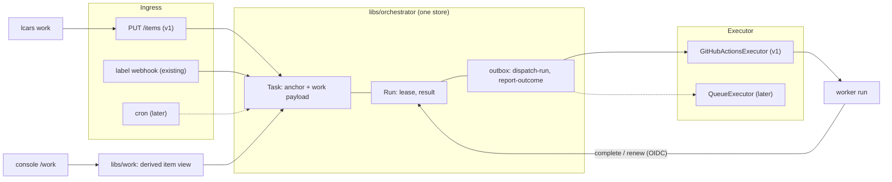
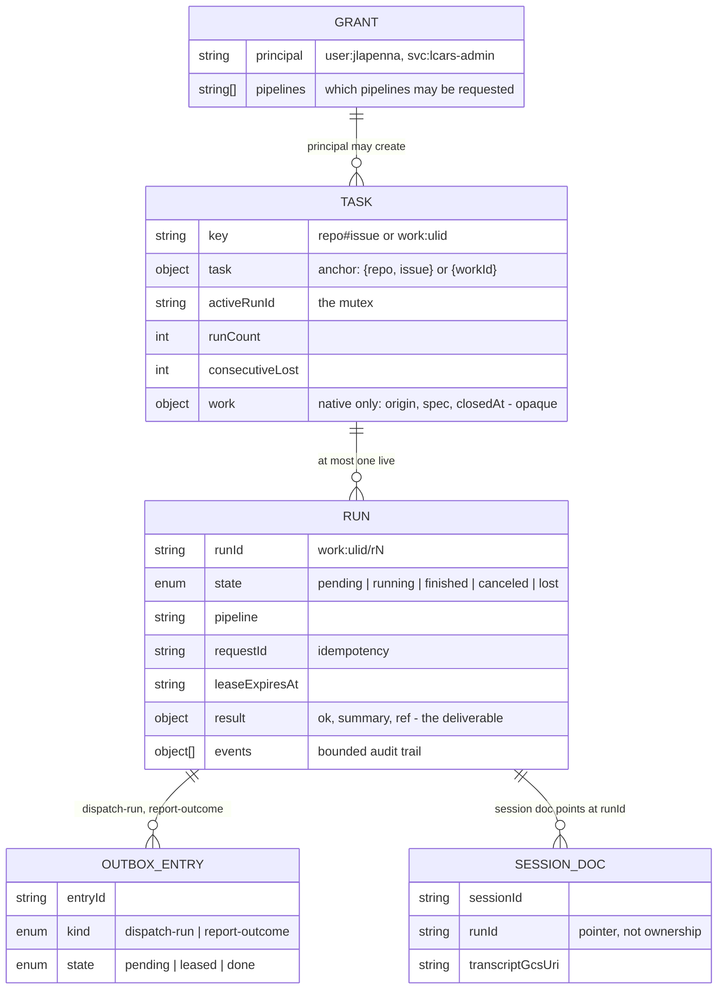
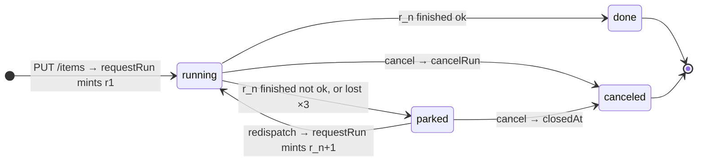
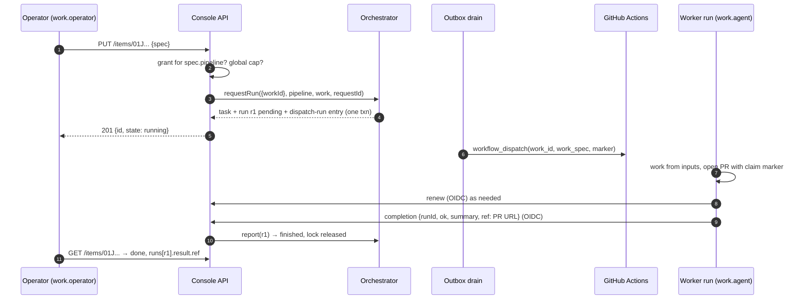

# Native work items: a GitHub-independent task system

- **Status:** Approved design, pre-implementation
- **Date:** 2026-08-23 (rewritten 2026-08-25 on the one-store model)
- **Scope:** Design for the whole program; implementation scope for
  sub-project 1 only (see [Sequencing](#sequencing)).

## Problem

GitHub is currently the fleet's only ingress, its only task store, and its
only execution queue. A task _is_ a GitHub issue (`libs/orchestrator`'s
`TaskId = {repo, issue}`), dispatch _is_ a label webhook, execution _is_ a
`workflow_dispatch` onto GitHub Actions, and the human-interaction surface
(parking, outcome comments, redispatch triggers) lives on issue threads.
That blocks two wanted capabilities:

1. **Agent-initiated work** — an agent (interactive session, fleet member,
   or service) asking LCARS to do work directly, with no human touching
   GitHub. This is the driving use case.
2. **Scheduled/recurring work** — cron-style self-originated tasks.

It also makes runner execution inseparable from GitHub Actions queues, which
the fleet wants as an eventual, swappable backend rather than a load-bearing
assumption.

## Why this shape

The first draft of this spec kept a new `WorkItem` store beside the
orchestrator's `Task` and synchronized the two. Review found that every
piece of machinery it grew — an `admit` outbox kind, an idempotency
reservation collection, a repair sweep, a "projection" rule for item
state, a `cancel-run` kind, a second run-facing API — was a patch for that
one split, and that its justification ("the orchestrator stays unchanged")
did not hold. This rewrite has **one store**: the orchestrator's `Task` is
the work item, item state is **derived** from its runs, and runs keep using
the control-plane surface they already have.

## Decisions

| Question                       | Decision                                                                                                                                                                                                                                                                            |
| ------------------------------ | ----------------------------------------------------------------------------------------------------------------------------------------------------------------------------------------------------------------------------------------------------------------------------------- |
| First end-to-end consumer      | Agent-initiated work via API                                                                                                                                                                                                                                                        |
| Structure                      | One store. The orchestrator's `Task` carries an opaque `work` payload for native anchors; `libs/work` is schemas, a derived view, and route handlers                                                                                                                                |
| Item state                     | Derived from the task's runs, never stored (one small `closedAt` flag aside)                                                                                                                                                                                                        |
| Deliverable                    | `Run.result` (`ok`, `summary`, `ref`) — already the orchestrator's shape; `ref` is the PR URL. Typed multi-results are a deferred extension                                                                                                                                         |
| GitHub's role for native tasks | None required. Native-first: console + API are the interaction surface                                                                                                                                                                                                              |
| API                            | Resource-oriented REST (`items`) + `lcars work` CLI; runs use the existing hosted control-plane routes, generalized to the anchor union                                                                                                                                             |
| API framework                  | **oRPC**, contract-first — the fleet-wide pick shared with sprinkles#4837 (same rejected alternatives: tRPC has no native OpenAPI, ts-rest's zod 4 support is RC). Contract in `libs/work`, Next fetch adapter in the console, typed client in `lcars`, OpenAPI as a build artifact |
| Console callers                | The same oRPC procedures exposed as server actions with the Auth.js session as the principal source — no second handler set for the UI                                                                                                                                              |
| Create                         | `PUT /items/{ulid}` with a client-generated ULID — one existing orchestrator transaction (`requestRun`)                                                                                                                                                                             |
| Auth                           | OAuth2 resource server with two additive scopes: `work.operator` (grant list) and `work.agent` (GitHub Actions OIDC). Standard library, issuers as configuration                                                                                                                    |
| v1 human issuer                | Google via per-user service-account impersonation (a Google _user_ credential cannot mint an audience-scoped ID token); LCARS-minted tokens with sub-project 4                                                                                                                      |
| Pipeline selection             | `spec.pipeline` required; the grant list says which pipelines each principal may request — not every agent may trigger Claude                                                                                                                                                       |
| Admission                      | One global live-run cap, sized to runner capacity; `429`                                                                                                                                                                                                                            |
| Spec delivery                  | As `workflow_dispatch` inputs in v1; the direct-runner backend fetches via API later                                                                                                                                                                                                |
| Execution                      | `Executor` seam at the outbox; GitHub Actions is backend 1, a direct-runner queue is backend 2                                                                                                                                                                                      |
| Sessions                       | Derived: the telemetry session doc already points at `runId`. Resume + lifecycle-pinned persistence are sub-project 6                                                                                                                                                               |
| Protocol end state             | Agents become GitHub-issue agnostic and use only the run-facing routes; issue-side affordances become control-plane projections (sub-project 5)                                                                                                                                     |

## Architecture

Invariants:

- The orchestrator remains a per-task mutex with an audit trail. It stores
  the `work` payload the way it stores `params`: opaque, never interpreted.
- `libs/work` depends on `libs/orchestrator`, never the reverse, and holds
  no state of its own.
- A run reports through the hosted control-plane routes it already uses.
  If the direct-runner backend later needs more (spec fetch), that becomes
  a route; nothing in v1 is added to the worker surface that GitHub Actions
  alone would need.

## Data model

### `Task` (existing, anchor-aware)

`TaskId` becomes a union of two shapes: the existing `{ repo, issue }`,
kept byte-for-byte as persisted today, and `{ workId }`. The variants are
discriminated by which key is present — never by a new required field,
because `FirestoreStore` zod-parses every persisted document on read and a
required field would reject the whole existing dataset. `taskKey()` emits
`repo#issue` (unchanged) or `work:<ulid>`; `:` is outside the repo-name
charset, so keys cannot collide. Zero migration.

A native task additionally carries `work`, opaque to the orchestrator:

- `origin` — `{ principal, channel: 'api' | 'cron' | 'console' }`. The
  principal is LCARS-native (`user:jlapenna`, `svc:lcars-admin`), never a
  raw issuer subject.
- `spec` — `{ title, description, pipeline, target: { repo } }`. All
  bounded strings, strict zod. `pipeline` is required; `target.repo` is
  required while GitHub Actions is the only backend (an item no backend can
  launch is rejected). No `mode` — a review is a task whose description
  says so.
- `closedAt?` — set when an operator cancels an item that has no live run.
  The one piece of stored item state.

### `Run` (existing, unchanged shape)

One execution. `result = { ok, summary, ref }` is already the deliverable
record; for native work `ref` is the PR URL. `requestId` is the
idempotency key the orchestrator already honors.

### Derived item state

Nothing stores an item state. `libs/work` derives it from the task and its
latest run:

| Condition                                                | State      |
| -------------------------------------------------------- | ---------- |
| `closedAt` set                                           | `canceled` |
| a run is live (`pending` / `running`)                    | `running`  |
| latest run `finished` with `ok: true`                    | `done`     |
| latest run `finished` with `ok: false`, or retries spent | `parked`   |
| latest run `canceled`                                    | `canceled` |

A `lost` run never surfaces on its own: the sweep either mints a fresh run
(state stays `running`) or, after the retry budget, leaves the last run
settled as a failure (state reads `parked`).

### Sessions

Telemetry already stores each agent session at `sessions/{sessionId}` with
a `runId` pointer. Item → runs → sessions is a query, not a link. The
relationships: Task 1→N Run (sequential, mutex-enforced); Run↔Session N:M
over time — a run has one primary session, an interactive takeover
continues a session past its run, and (sub-project 6) a later run may
resume an earlier one. Session **resume** and lifecycle-pinned
**persistence** are one feature and arrive together: `redispatch` gains
`resumeSessionId`, and a session pointing at any run of an open item is
exempt from `expireAt` reaping until the item settles.

### Collections and writers

| Collection             | Written by                                                                                           |
| ---------------------- | ---------------------------------------------------------------------------------------------------- |
| `tasks/{key}`          | Orchestrator transactions. `work.closedAt` is the one field `libs/work` writes, via the cancel route |
| `runs/{runId}`         | Orchestrator transactions (request, dispatch, renew, report, sweep)                                  |
| `outbox/{entryId}`     | Orchestrator decisions; the drain leases and settles                                                 |
| `sessions/{sessionId}` | Telemetry sidecar; untouched                                                                         |
| grants                 | Configuration                                                                                        |

## API

Resource-oriented REST under `apps/console/src/app/api/work/v1/`. The
Edge proxy (`apps/console/src/proxy.ts`) returns `401` for any `/api`
path not in its allow-list before any handler runs; `/api/work/v1/` is
added to `publicPrefixes` and `proxy.test.ts`'s route scan is extended to
the tree (#885 and #1232 each shipped without this).

### Framework: oRPC, contract-first

The fleet's one API framework (decided with sprinkles#4837): **oRPC** —
zod 4 via Standard Schema, REST-shaped routes declared on the contract
(`oc.route({ method: 'PUT', path: '/items/{id}' })`), OpenAPI generation,
and a typed client derived from the contract. Each repository adopts it as
an ordinary third-party dependency; nothing is shared as source.

- **Contract** lives in `libs/work` beside the schemas, dependency-light
  and free of `server-only` imports so the CLI can import it (the same
  discipline `dispatch-contracts` follows for `'use client'` bundles).
- **Handler**: one catch-all route,
  `apps/console/src/app/api/work/v1/[[...rest]]/route.ts`, using the
  fetch adapter. The per-request **context** is where auth lives: it
  accepts either a bearer token (Google service-account or GitHub Actions
  OIDC, verified as below) _or_ an Auth.js session (`auth()`), and maps
  both to one principal + scopes. The console's own pages therefore call
  the same procedures as **server actions** (`.actionable()`) with the
  session as principal — `user:<github-login>` — instead of a second
  handler set.
- **Clients**: `lcars work` uses the typed client; agents and scripts use
  the generated OpenAPI document with `curl`; a later MCP wrapper is
  generic tools over the same contract, as sprinkles plans.
- **Migration-off path**, since oRPC is young: the contract is plain zod
  plus a route table, so replacing the framework is mechanical. Existing
  hand-rolled control-plane routes are not migrated in v1.

### `items` — issuing and following work (`work.operator`)

| Route                        | Purpose                                                                                                                                                                               |
| ---------------------------- | ------------------------------------------------------------------------------------------------------------------------------------------------------------------------------------- |
| `PUT /items/:id`             | Create. `:id` is a client-generated ULID; the body is `spec`. Calls `requestRun({ workId }, pipeline, work, requestId: id)`. `201` on create, `200` with the existing item on replay. |
| `GET /items/:id`             | Derived state, spec, origin, runs (with results), and the sessions telemetry holds for those runs.                                                                                    |
| `GET /items`                 | List/filter by state, principal, target repo.                                                                                                                                         |
| `POST /items/:id/cancel`     | Live run → `cancelRun`. No live run → set `closedAt`. Already closed → `409`.                                                                                                         |
| `POST /items/:id/redispatch` | `parked` only → `requestRun` with the same `work` and a fresh `requestId`; `409` otherwise. The reply-trigger analog.                                                                 |

Idempotent create is the standard client-ID PUT: two replays of one ULID
hit one document, and the orchestrator's `duplicate-request` covers the
window while r1 is live. Admission is checked before `requestRun`: a
principal without a grant for `spec.pipeline` gets `403`; a fleet at the
global live-run cap gets `429` with `Retry-After`. Status is poll-only in
v1 (`lcars work status --watch` polls).

### Runs — the existing hosted routes, generalized (`work.agent`)

Workers already report through OIDC-authenticated control-plane routes.
They are generalized to the anchor union rather than duplicated:

| Route (existing)      | Change for native anchors                                                                                                                 |
| --------------------- | ----------------------------------------------------------------------------------------------------------------------------------------- |
| completion (`report`) | Body names the run by `runId` instead of `issue`; the run's `task` may be either anchor shape. `{ ok, summary, ref }` is the deliverable. |
| lease renew           | Same generalization.                                                                                                                      |

The spec reaches the agent as `workflow_dispatch` inputs (`work_id`,
`work_spec`), so no fetch route exists in v1. Session status and progress
use the channel that already exists (`lcars session title` / status
annotations); the item's page shows them through the session pointer.

### One request, end to end

Step 4 is the only decision, and it is the transaction the orchestrator
already performs for label dispatch. Nothing is projected afterwards.

## Auth

The API is a plain OAuth2 resource server (RFC 6750 bearer tokens): verify
the JWT against the issuer's OIDC discovery + JWKS with `jose` (already
used by `github-actions-oidc.ts`, one cached JWKS per issuer), check
audience, apply the entry's claim predicates, map to a principal and
scopes. An Auth.js session is a third source for browser and server-action
callers, mapped to `user:<github-login>` with `work.operator`. Scopes are
additive; sources confine which scopes they may confer.

| Scope           | Confers                            | Issuer (v1)                                | Principal                |
| --------------- | ---------------------------------- | ------------------------------------------ | ------------------------ |
| `work.operator` | The `items` routes, per grant list | Google — service-account identity          | mapped from the SA email |
| `work.agent`    | The run routes for its own run     | GitHub Actions OIDC, with claim predicates | `agent:run/<runId>`      |

- **Grant list.** Configuration: `{ principal → pipelines[] }`. A
  principal absent from it has no scope; one requesting a pipeline outside
  its list gets `403`. This is the whole authorization model — there is no
  admin scope in v1 because no admin-only route exists; the maintainer acts
  through the console's existing auth wall. An agent acting as the fleet's
  administrator is just a service-account principal with a broad grant.
- **Google, via impersonation.** A Google _user_ credential cannot mint an
  ID token for an LCARS-chosen audience (`gcloud auth print-identity-token
--audiences` refuses non-service accounts), and accepting Google's public
  client audiences would make every ID token the user mints for any other
  service a valid LCARS bearer. So each human impersonates a per-user
  service account (`--impersonate-service-account … --audiences <lcars>
--include-email`; one IAM Token Creator binding per user under the usual
  Terraform approval), and the `lcars` CLI hides it. Chosen because it is
  free today, not because it is contractual: moving to another IdP, or to
  LCARS-minted tokens (sub-project 4), is a configuration entry.
- **GitHub Actions, with predicates.** Signature, issuer, and audience are
  not sufficient — any repository can mint a token requesting our audience.
  The existing predicates apply: `repository` in the control-plane
  allow-list, `ref` is `refs/heads/main`, `event_name` is
  `workflow_dispatch`, `workflow_ref` claim-relative to the worker
  workflow files, and `job_workflow_ref` pinned **per calling job** — a
  token minted inside the agent job carries
  `…/agent-lane.yml@refs/heads/main` (the reusable workflow that defines
  the job, verified live in #1347), the fallback finalizer's carries its
  own. The completion route today pins only the finalizer; the per-job pin
  set is the one real fix in this area.
- **Binding a token to its run.** The predicates prove "a trusted worker on
  an allowed repository", not "the worker for _this_ run". The run routes
  therefore verify that the Actions run named by the token's own
  `(repository, run_id)` has a `display_title` dispatch marker whose
  `intentId` is the `runId` in the body — the deterministic join
  `orchestrator-terminal-runs.ts` already uses. One GitHub API call, no
  stored binding state. This replaces the completion route's current
  `run.task.issue === body.issue` tie, which cannot hold for a native
  anchor, and applies to both anchor kinds.

## Execution abstraction

The seam is the outbox: a `dispatch-run` entry is handed to an
**`Executor`** — `dispatch(run, task)` — selected per anchor. Cancel is
what it is today: `cancelRun` settles the run and the job's later calls are
refused; nothing reaches into Actions.

### Backend 1 (v1): `GitHubActionsExecutor`

Today's `workflow_dispatch` drain
(`apps/console/src/lib/orchestrator-dispatch.ts`) as the first
implementation. GitHub Actions remains the queue and credential broker in
v1 — deliberately, since the driver is agent-initiated _ingress_, not
runner independence. The repository comes from `anchorTarget(task)`: the
anchor's `repo` for GitHub, `work.spec.target.repo` for native. The same
helper replaces the other `task.repo` / `task.issue` reads
(`orchestrator-routes.ts`, `orchestrator-terminal-runs.ts`), and
`FirestoreStore.listRuns` gains an anchor-aware query — the store contract
spec covers both anchors and runs against the Firestore emulator in CI
(today its Firestore half is skipped there).

The worker workflows are issue-anchored at every layer — `issue` is a
required input, both jobs are gated on it, `run-name` embeds it, the lane
reads it in roughly ten steps, and the fallback finalizer pipes it through
`tonumber`. The native path:

- `issue` becomes optional; `work_id` and `work_spec` are the alternative
  inputs, and the job gates accept either anchor.
- `run-name` and the dispatch marker use `work:<ulid>/r<n>`; the marker
  grammar (`libs/dispatch-contracts/src/marker.ts`) gains that form, pinned.
- Each issue-reading lane step gets a native branch: the prompt is built
  from `work_spec`, `verify-deliverable` checks for the PR with this run's
  claim marker (as today), and the finalizer posts completion by `runId`.
- `report-outcome` for a native anchor posts nothing to GitHub; the item's
  state is already derivable. (`ref` is dispatched as `main`; there is no
  `target.ref` in v1.)

### Backend 2 (later): `QueueExecutor`

The actual de-GitHub-ing, as its own sub-project. LCARS keeps a claimable
run queue (Firestore, the outbox's lease/fencing pattern); the
runner-autoscaler polls it and launches the same runner image in "direct"
mode, where a bootstrap claims a run, fetches the spec through a new route,
runs the agent CLI, and reports through the same run routes. Runner
identity becomes an LCARS-minted per-run token.

## Dispatched-agent protocol in native mode

`agent-protocol` is written against an issue. v1 adds a short **native
mode** section mapping each issue-side action; label-driven behavior is
untouched.

| Protocol section                 | Issue mode (today)                   | Native mode (v1)                                                                                        |
| -------------------------------- | ------------------------------------ | ------------------------------------------------------------------------------------------------------- |
| 1. Takeover comment              | Comment naming the resume command    | Nothing to post: the session doc names the session; the console renders the takeover affordance from it |
| 2. Eyes-reaction acknowledgement | 👀 on the issue                      | Implicit: dispatch confirmation moves r_n to `running`                                                  |
| 3. One edited progress comment   | Single comment, edited in place      | `lcars session title` / status — the existing channel                                                   |
| 4. Parking                       | `status:needs-human` label + comment | Completion with `ok: false` and the summary; the item reads `parked`                                    |
| 5. Deliverable rule              | PR carrying the attempt-claim marker | Same PR and marker; `ref` in the completion body                                                        |
| 6–12. Everything else            | unchanged                            | unchanged                                                                                               |

PRs from native tasks are authored by the same bot logins, so
`agent-automerge.yml` treats them identically; the PR body references
`Work: work:<ulid>` rather than `Fixes #N`.

**End state.** Native mode is transitional. Once sub-project 5 makes
label-driven work carry a `work` payload too, every issue-side affordance
becomes a control-plane projection written by the drain, and the
agent-facing contract is the run routes alone.

## Console

Two pages behind the existing auth wall: `/work` — the derived list, parked
first; `/work/[id]` — spec, runs with results, sessions, and the two
actions (cancel, redispatch).

## Error handling

Inherited: idempotent create; `duplicate-request` for in-flight replays;
outbox lease retry for dispatch failures; lease expiry → bounded auto-retry
→ `parked` by derivation. New surface follows house style: strict zod,
bounded strings, fail-closed validation. `403`/`429` are the only
synchronous refusals besides validation.

## Testing

- Store contract spec against memory and Firestore stores, the Firestore
  half now running against the emulator in CI; persisted-shape fixtures for
  the anchor union.
- Derived-state table-driven spec; route tests with stubbed tokens; claim
  predicate specs including per-job `job_workflow_ref` pins; proxy
  allow-list scan extended to `api/work/v1`.
- Workflow contract test for the optional `issue` / `work_id` gates; pinned
  marker grammar and `work:` key formats.
- The generated OpenAPI document checked in and diffed in CI, so a contract
  change is a visible review artifact.
- No real git in unit tests. Console E2E stays off while paused (#1049);
  the real-path proof is one native task dispatched end-to-end producing a
  PR on a test repo.

## Sequencing

1. **v1 (this spec):** adopt oRPC; anchor union + `work` payload + `anchorTarget` +
   anchor-aware store; `items` routes, grant list, cap, OAuth2 gate with
   per-job pins and marker binding; generalized completion/renew; native
   lane path; `lcars work`; two console pages; native-mode protocol
   section.
2. **Notifications:** parked-work paging (Telegram) + console polish.
3. **Cron ingress:** a scheduler minting items from a schedule.
4. **`QueueExecutor`:** direct runner mode + LCARS-minted run tokens +
   spec-fetch route.
5. **Ingress unification:** label-driven work and Quick Tasks carry `work`;
   issue affordances become projections; the protocol collapses to the run
   routes.
6. **Session resume and persistence.**

## Deferred extensions

Added when something needs them; nothing above precludes them:

- Typed multi-results (`report`, `artifact`, `message`) beyond
  `Run.result`.
- Operator-attached links/evidence on an item.
- Per-principal caps, an admin scope, and `grants` as a resource (the
  trigger: an admin agent that must manage grants through the API).
- Streaming status; MCP transport; `target.ref`.

## Non-goals (v1)

- Migrating GitHub-anchored tasks or Quick Tasks.
- Targetless items; a review dispatch mode; a default pipeline.
- Notifications for parked work.
- Any change to the dispatched-agent protocol for label-driven work.
- Any issuer beyond Google (service-account identity) and GitHub Actions.
